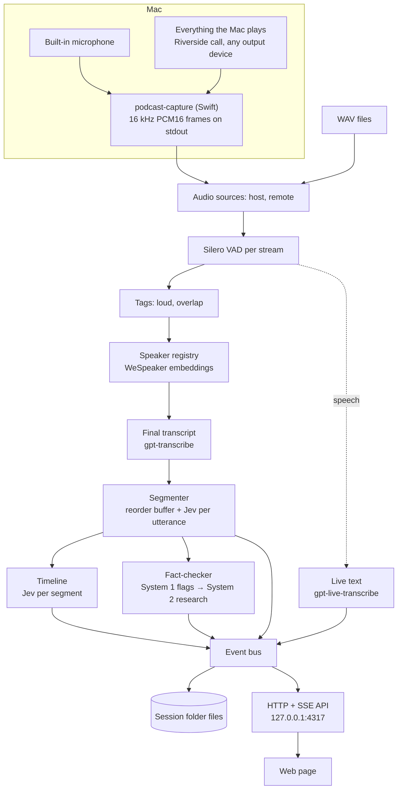

# Architecture

Podcast Assistant has two parts. The **engine** — a Node server plus a native capture helper — owns everything that captures, thinks, and stores. The **front end** is a thin web page that only reads the engine's state and events and posts commands; it could be replaced (for example by a SwiftUI app) without touching the engine.

## Capture — `native/capture/` and `src/audio/nativeSource.ts`

`podcast-capture` is a Swift command-line helper (swift-tools 6.0, Swift 5 language mode) that uses Apple frameworks only:

- **`host`** — the MacBook's built-in microphone, chosen explicitly whatever the default input is, captured with `AVAudioEngine` (voice processing off, channel 0).
- **`remote`** — a private, global Core Audio tap (`CATapDescription(monoGlobalTapButExcludeProcesses: [])`, macOS 14.2+) of everything the Mac plays, read through a private aggregate device whose main sub-device is the current default output. When the default output changes (AirPods connect), the aggregate is rebuilt.
- **ClockLock** timestamps each buffer from its host time and keeps each stream's sample count within 20 ms of the session clock, inserting silence when a stream falls behind and dropping samples when it runs ahead, so sample index ÷ 16 = session milliseconds on both streams.
- **Stdout** carries binary frames only: `PCAP`, a stream byte (0 host, 1 remote), 3 reserved bytes, `sessionMs` (float64 LE), a sample count (uint32 LE), and that many PCM16 LE samples at 16 kHz (1,600 per frame, about every 100 ms). **Stderr** carries JSON status lines (`started` with `epochMs`, `device_changed`, `warning`, `error`).
- `--list-devices` prints input devices; `--probe <s>` prints peak and RMS levels (used by `capture:test` and `preflight`).

The Info.plist is embedded in the binary (`-sectcreate __TEXT __info_plist`), without which macOS refuses the permissions. macOS attributes both permissions to the app that launched the terminal; a denied permission delivers silence, not an error (see [Gotchas](gotchas.md)).

The Node adapter spawns the helper, parses frames across partial reads, maps helper time onto the session clock (`started.epochMs − session start`), and re-chunks into 512-sample Float32 frames, filling gaps with silence. A malformed frame kills the helper; an unexpected exit is restarted up to 3 times per session, 1 s apart, with an `error` event each time, then the live sources end cleanly. Stopping closes stdin, then sends SIGTERM after 2 s and SIGKILL after 5 s.

`FileSource` plays WAV files as the same 512-sample frames — at real-time pace (`speed: 1`) or as fast as possible (`"max"`). Nothing downstream knows which kind of source it reads.

## The session pipeline — `src/pipeline/session.ts`

A `Session` wires everything together and runs until input ends or it is stopped:

1. **Merge.** Frames from both sources are merged in `sessionMs` order, so file streams stay aligned at any speed. Each frame is written to `host.wav` / `remote.wav` as received.
2. **VAD.** One Silero VAD per stream (threshold 0.5, 0.25 s minimum speech, 0.5 s minimum silence, 20 s maximum) cuts utterances at pauses, never at fixed intervals. Utterance ids (`u_<n>`) come from one session-wide counter.
3. **Tags.** `loud` — the utterance's RMS is at least 6 dB above the median of that stream's last 50 utterances. `overlap` — it overlaps an utterance on the other stream by at least 1 s (computed when the segmenter releases it).
4. **Speakers.** Local voice embeddings assign or create a speaker (see [Speakers](speakers.md)).
5. **Transcription.** Each utterance is uploaded for its final text; while it is still being spoken, live text streams to the page (see [Transcription](transcription.md)).
6. **Segmenter.** A reorder buffer releases utterances in `startMs` order across both streams — when everything earlier has finished transcribing and the other stream has passed that time and is not mid-speech, or 8 s after transcription. Each non-filler utterance gets one Jev request carrying the `boundary` question and the System 1 fact-check questions; code closes segments (see [Jev](jev.md)).
7. **Timeline.** Each closed segment gets one Jev request with the host-editable label set (see [Jev](jev.md)).
8. **Fact-checker.** System 1 answers from step 6 flag claims; System 2 researches, audits, and rewrites (see [System 1 and System 2](system1-system2.md)).
9. **Stats** every 60 s and at the end (`src/pipeline/stats.ts`): the Rogan index (share of labelled time on `personal_life` and `other_topics`), talk time, disagreements and duration-weighted hype per speaker, predictions, recommendations, clip-worthy segments, fact-check totals, and cost.

At end of input, in order: flush every VAD; wait for transcriptions and the segmenter; close the open segment (`final: true`) and label it; drain research, audits, and rewrites for at most 180 s; emit `stats`; write `speakers.json`; emit `session.ended`.

## Event bus and API — `src/store/events.ts`, `src/server/main.ts`

Every result is an event with a payload checked against a zod schema (a failed check is logged, the event still goes out), a sequence number, and a timestamp. The bus keeps the session's history (replayed to every new SSE connection), and the session appends each event to `events.jsonl`; `utterance.partial` is the one transient type, streamed but never stored.

| Group | Events |
| --- | --- |
| Session | `session.started`, `session.ended`, `health` (per stream, every second: RMS dBFS, ms since last frame, utterances in the last minute, capture device) |
| Speech | `utterance.partial`, `utterance`, `speaker.created`, `speaker.updated`, `speaker.merged` |
| Timeline | `segment.closed`, `segment.labels`, `section.updated` |
| Fact-check | `claim.flagged`, `claim.duplicate`, `claim.repeat`, `claim.researching`, `claim.verdict`, `claim.dropped`, `claim.disputed`, `audit`, `s1.version`, `s1.memory` |
| Accounting | `cost`, `budget.exhausted`, `stats`, `error` |

The server uses Node's `http` module, binds to 127.0.0.1 only, and serves one session at a time (an `Engine` owns it):

| Method | Route | Does |
| --- | --- | --- |
| GET | `/api/events` | SSE: the session's events so far, then live |
| GET | `/api/state` | Full current state (or a recorded session's snapshot) |
| POST | `/api/session/start` | `{ mode: "live", mic?, name? }` or `{ mode: "replay", dir \| sessionId, speed, name? }` |
| POST | `/api/session/stop` | Stop reading input; in-flight work completes |
| GET | `/api/devices` | The helper's input devices |
| POST | `/api/speakers/:id/rename`, `/api/speakers/merge` | Speaker edits (see [Speakers](speakers.md)) |
| PUT | `/api/labels`, `/api/stories`; POST `/api/labels/relabel` | Timeline label set, tonight's stories, relabelling (see [Jev](jev.md)) |
| POST | `/api/claims/:id/override`, `/api/s1/rollback` | Host dispute, System 1 rollback (see [System 1 and System 2](system1-system2.md)) |
| GET | `/api/stats` | Current stats |
| GET, PATCH, POST | `/api/sessions`, `/api/sessions/:id`, `/api/sessions/:id/open` | The recordings library (see [Recordings](recordings.md)) |

It also serves `web/index.html` at `/`, and `web/styles.css` and `web/dist/**` as static files, confined to `web/`.

## Web front end — `web/`

Plain TypeScript compiled by `tsc` to browser ES modules (`npm run build:web`, run by `npm run serve`) — no bundler, no framework, no chart library. It loads `GET /api/state`, then applies `GET /api/events`; every update is idempotent (by id, and audits by timestamp) because the stream replays history on connect.

- **Top:** session controls (microphone picker, Start live, replay folder and speed, Stop), stream meters with last-frame age (red when a stream's level stays at or below −50 dBFS for more than 10 s, or no frame arrives for more than 3 s), and a cost meter against the session cap.
- **Timeline** (inline SVG): the `subject` lane (AI subjects as shades of one colour), the `mode` lane, heat and hype lines, markers (disagreement, hot take, prediction, recommendation, clip-worthy, humour), section brackets, and a dashed "in progress" bar for the open segment. Faded labels are dimmed; clicking a segment or marker jumps to the transcript.
- **Transcript** with segment dividers, live text, filters (markers, speaker, subject), and click-to-rename.
- **Fact-check cards:** queued → researching → verdict, the restated claim, correction, sources, research latency, a repeat badge, and a "Host disputes" button; the most recently active card is on top.
- **Side tabs:** Recordings, System 1 (active version, counters, last promotion or rejection, rollback), Speakers (rename, merge), Labels (question editor, stories, relabel), Stats, Log.

The page is laid out to be legible when shared as a window in Riverside at 1280 × 720.

## Budgets — `src/budget.ts`

One ledger per session, plus the development total read from `sessions/**/*.jsonl` when the session starts. Every external call runs `assertCanSpend` before and `record` after — live text checks when it opens a connection and at every committed turn — in three buckets (`transcription` — final and live, `jev`, `s2`), which drive the `cost` event.

- **Session cap** (`budget.sessionCapUsd`, $5) — always enforced.
- **Development cap** (`budget.devCapUsd`, $3) — the total of `cost_usd` over call rows in `sessions/**/*.jsonl`, enforced by replays (including `serve --replay`) and `smoke`, not by live sessions or `preflight`. `--allow-over-dev-cap` lifts it.
- When a cap is reached, or OpenRouter returns a non-transient 402, `budget.exhausted` is emitted and further calls are refused.

## Configuration — `config/`

`src/config.ts` validates all three files with zod at startup; code never writes to them at runtime.

| File | Holds |
| --- | --- |
| `config/app.json` | Server port, budgets, VAD, speakers, transcription (final and live), Jev client, segmentation, timeline, System 2, fact-check loop |
| `config/labels.default.json` | The `boundary` question and the host-editable timeline label set |
| `config/factcheck.s1.default.json` | System 1's default question set and thresholds (`s1@1`) |

Validation rejects, among others, `minSegmentMs > maxSegmentMs`, a `choice` without criteria or without a `none` / `other…` option, a `score` with fewer than 2 levels, non-snake_case ids, and a System 1 set whose `claim_type` does not have exactly its 7 keys.

## Tests

`npm test` runs offline: `tests/setup.ts` replaces `fetch` with a function that throws, and every client takes its `fetch` (or WebSocket) through its constructor so tests pass fakes. The suite covers audio and VAD on the fixture, speakers, transcription, live text, the Jev client's retry rules, the segmenter, the fact-checker loop and gate, the timeline, stats, the capture adapter (with a fake helper process), the HTTP API, the library, and an end-to-end session with fake services that also checks no API key reaches any file or event. `npm run smoke` and `npm run preflight` are the live checks.

Related: [Mission](mission.md), [Jev](jev.md), [System 1 and System 2](system1-system2.md), [Transcription](transcription.md), [Speakers](speakers.md), [Recordings](recordings.md).
