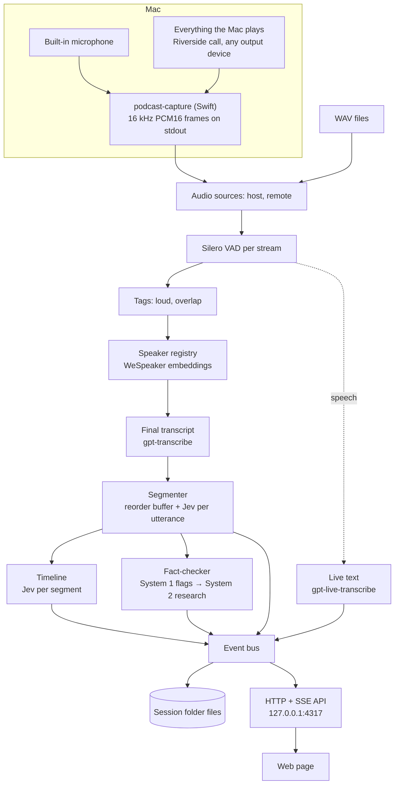

# Architecture

Podcast Assistant has two parts. The **engine** — a Node server plus a native capture helper — owns everything that captures, thinks, and stores. The **front end** is a thin web page that only reads the engine's state and events and posts commands; it could be replaced (for example by a SwiftUI app) without touching the engine.

## Capture — `native/capture/` and `src/audio/nativeSource.ts`

`podcast-capture` is a Swift command-line helper (swift-tools 6.0, Swift 5 language mode) that uses Apple frameworks only:

- **`host`** — the MacBook's built-in microphone, chosen explicitly whatever the default input is, captured with `AVAudioEngine` (voice processing off, channel 0).
- **`remote`** — a private, global Core Audio tap (`CATapDescription(monoGlobalTapButExcludeProcesses: [])`, macOS 14.2+) of everything the Mac plays, read through a private aggregate device whose main sub-device is the current default output. When the default output changes (AirPods connect), the aggregate is rebuilt.
- **ClockLock** timestamps each buffer from its host time and keeps each stream's sample count within 20 ms of the session clock, inserting silence when a stream falls behind and dropping samples when it runs ahead, so sample index ÷ 16 = session milliseconds on both streams.
- **Stdout** carries binary frames only: `PCAP`, a stream byte (0 host, 1 remote), 3 reserved bytes, `sessionMs` (float64 LE), a sample count (uint32 LE), and that many PCM16 LE samples at 16 kHz (1,600 per frame, about every 100 ms). **Stderr** carries JSON status lines (`started` with `epochMs`, `device_changed`, `warning`, `error`).
- `--list-devices` prints input devices; `--probe <s>` prints peak and RMS levels (used by `capture:test` and `preflight`).

The Info.plist is embedded in the binary (`-sectcreate __TEXT __info_plist`), without which macOS refuses the permissions. macOS attributes both permissions to the app that launched the terminal; a denied permission delivers silence, not an error (see [Gotchas](gotchas.md)).

The Node adapter spawns the helper, parses frames across partial reads, maps helper time onto the session clock (`started.epochMs − session start`), and re-chunks into 512-sample Float32 frames, filling gaps with silence. A malformed frame kills the helper; an unexpected exit is restarted up to 3 times per session, 1 s apart, with an `error` event each time, then the live sources end cleanly. Stopping closes stdin, then sends SIGTERM after 2 s and SIGKILL after 5 s.

`FileSource` plays WAV files as the same 512-sample frames — at real-time pace (`speed: 1`) or as fast as possible (`"max"`). Nothing downstream knows which kind of source it reads.

## The session pipeline — `src/pipeline/session.ts`

A `Session` wires everything together and runs until input ends or it is stopped:

1. **Merge.** Frames from both sources are merged in `sessionMs` order, so file streams stay aligned at any speed. Each frame is written to `host.wav` / `remote.wav` as received.
2. **VAD.** One Silero VAD per stream (threshold 0.5, 0.25 s minimum speech, 0.5 s minimum silence, 30 s maximum) cuts utterances at pauses, never at fixed intervals. Utterance ids (`u_<n>`) come from one session-wide counter.
3. **Tags.** `loud` — the utterance's RMS is at least 6 dB above the median of that stream's last 50 utterances. `overlap` — it overlaps an utterance on the other stream by at least 1 s (computed when the segmenter releases it).
4. **Speakers.** Local voice embeddings assign or create a speaker (see [Speakers](speakers.md)).
5. **Transcription.** Each utterance is uploaded for its final text; while it is still being spoken, live text streams to the page (see [Transcription](transcription.md)).
6. **Segmenter.** A reorder buffer releases utterances in `startMs` order across both streams — when everything earlier has finished transcribing and the other stream has passed that time and is not mid-speech, or 8 s after transcription. Each non-filler utterance gets one Jev request carrying the `boundary` question and the System 1 fact-check questions; code closes segments (see [Jev](jev.md)).
7. **Timeline.** Each closed segment gets one Jev request with the host-editable label set (see [Jev](jev.md)).
8. **Fact-checker.** System 1 answers from step 6 flag claims; System 2 researches, audits, and rewrites (see [System 1 and System 2](system1-system2.md)).
9. **Stats** every 60 s and at the end (`src/pipeline/stats.ts`): the Rogan index (share of labelled time on `personal_life` and `other_topics`), talk time, disagreements and duration-weighted hype per speaker, predictions, recommendations, clip-worthy segments, fact-check totals, and cost.

At end of input, in order: flush every VAD; wait for transcriptions and the segmenter; close the open segment (`final: true`) and label it; drain research, audits, and rewrites for at most 180 s; emit `stats`; write `speakers.json`; emit `session.ended`.

## Event bus and API — `src/store/events.ts`, `src/server/main.ts`

Every result is an event with a payload checked against a zod schema (a failed check is logged, the event still goes out), a sequence number, and a timestamp. The bus keeps the session's history (replayed to every new SSE connection), and the session appends each event to `events.jsonl`. Three types are transient, streamed but never stored: `utterance.partial`, and `call.started` / `call`, the live view of every Jev and System 2 call (the call logs on disk are their record).

| Group | Events |
| --- | --- |
| Session | `session.started`, `session.ended`, `session.paused` / `session.resumed` (with the session time `atMs`), `health` (per stream, every second: RMS dBFS, ms since last frame, utterances in the last minute, capture device) |
| Speech | `utterance.partial`, `utterance`, `speaker.created`, `speaker.updated`, `speaker.merged` |
| Timeline | `segment.closed`, `segment.labels`, `section.updated` |
| Fact-check | `claim.flagged`, `claim.duplicate`, `claim.repeat`, `claim.researching`, `claim.verdict`, `claim.dropped`, `claim.disputed`, `audit`, `s1.version`, `s1.memory` |
| Accounting | `cost`, `budget.exhausted`, `stats`, `error` |
| Calls (transient) | `call.started` (`system`: `s1` or `s2`, `purpose`) when a Jev or System 2 call is sent; `call` with the logged row when it completes (a Jev row also carries the question definitions, for display) |

The server uses Node's `http` module, binds to 127.0.0.1 only, and serves one session at a time (an `Engine` owns it):

| Method | Route | Does |
| --- | --- | --- |
| GET | `/api/events` | SSE: the session's events so far, then live |
| GET | `/api/state` | Full current state (or a recorded session's snapshot) |
| POST | `/api/session/start` | `{ mode: "live", mic?, name? }` or `{ mode: "replay", dir \| sessionId, speed, name? }` |
| POST | `/api/session/stop` | Stop reading input; in-flight work completes. When the session ends, the engine serves it as an opened recording (see [Recordings](recordings.md)) |
| POST | `/api/session/pause`, `/api/session/resume` | Live sessions only: while paused, incoming audio is replaced by silence, so nothing is heard, transcribed, or spent, and the WAVs and session times stay aligned; Stop still works |
| GET | `/api/devices` | The helper's input devices |
| POST | `/api/speakers/:id/rename`, `/api/speakers/merge` | Speaker edits (see [Speakers](speakers.md)) |
| GET | `/api/speakers/suggestions?voices=` | Merge suggestions for the session on screen: which speakers are the same person, with a voice match and a confidence (see [Speakers](speakers.md)) |
| PUT | `/api/labels`, `/api/stories`; POST `/api/labels/relabel` | Timeline label set, tonight's stories, relabelling (see [Jev](jev.md)) |
| POST | `/api/claims/:id/override`, `/api/s1/rollback` | Host dispute, System 1 rollback (see [System 1 and System 2](system1-system2.md)) |
| GET | `/api/stats` | Current stats |
| GET | `/api/calls?system=s1\|s2&limit=` | The session on screen's most recent Jev (`s1`) or System 2 (`s2`) call rows, oldest first, and the models its config named |
| POST | `/api/sessions/close` | Leaves an opened recording's view (back to no session); a session on air is not affected |
| GET | `/api/about` | The project's name, version (the root `package.json`'s `version`, the only place it lives), and license (`id`, `holder`, and the `LICENSE` text); the page shows them in the settings menu's footer, the license opening in a window |
| GET | `/api/engine` | `{ startedAt, stale }`: `stale` is true when a `src/**/*.ts` file changed after the server started; the page then shows a banner asking for a restart |
| GET, PATCH, POST, DELETE | `/api/sessions`, `/api/sessions/:id`, `/api/sessions/:id/open` | The recordings library (see [Recordings](recordings.md)) |

It also serves `web/index.html` at `/` and at `/recordings/<id>` (the page's own URLs), and `web/styles.css`, `web/dist/**` and `web/fonts/**` as static files, confined to `web/`.

## Web front end — `web/`

Plain TypeScript compiled by `tsc` to browser ES modules (`npm run build:web`, run by `npm run serve`) — no bundler, no framework, no chart library. It loads `GET /api/state`, then applies `GET /api/events`; every update is idempotent (by id, and audits by timestamp) because the stream replays history on connect.

The look is "On Air", modelled on TV broadcast graphics: one dark navy theme, Barlow Condensed for labels and Barlow for text (both self-hosted in `web/fonts/`, SIL Open Font License), drawn SVG glyphs for markers (no emoji), and angled straps instead of rounded cards. The layout is three rows:

- **Header (one row):** an ON AIR block, only while a session is capturing (On air, Paused, Replay, or Stopping; it wipes in like a breaking-news strap when a session starts, and with a recording open or no session the header starts at the strap), the session name (click it to rename the session in place: Enter or leaving the field saves, Escape cancels; the name goes to the session's `meta.json`), the elapsed clock, stream meters with device and last-frame age (red when a stream's level stays at or below −50 dBFS for more than 10 s, or no frame arrives for more than 3 s), the spend against the session cap (breakdown on hover; for an opened recording, labelled Cost: what that recording cost when it ran), and the controls: microphone picker, how many people are on the call (1–4 or Any, sent with Start live and replays and remembered in the browser; see [Speakers](speakers.md)), Start live, Pause / Resume (live sessions), Stop, a replay popover (folder and 1× / max speed), and a settings cog.
- **Transcript and fact-checks (two columns)**, split by a divider you can drag (25–75 %, arrow keys too; double-click resets; the split is remembered in the browser):
  - the transcript, caption style, with segment dividers, live text, filters (markers, speaker, subject), and click-to-rename; a speaker's name tag appears once per run of consecutive lines, and inferred speakers show as a muted "name *";
  - the right column has three tabs. **Fact-check**: a solid verdict block (False, Supported, Misleading…, or Queued / Checking / Dropped), queued → researching → verdict steps, the restated claim, correction, sources, research latency, a repeat badge, and a "Host disputes" button; a tally of verdicts sits in the column header, and the most recently active card is on top.
  - **Fast · slow thinking**, written for an audience: System 1 (Jev) and System 2 (the configured model, GPT-6 Luna) side by side with their models, roles ("judges every line in under a second" / "researches only what System 1 flags"), calls, average time, cost per call, and total, joined by "flags claims" and "rewrites its questions". A system glows and reads Thinking while one of its calls is in flight, and the "flags claims" link animates while System 2 works. Then the cost of System 1's judgments against System 2's average ("N× cheaper with System 1"); a funnel from every line heard, to lines checked by Jev, flagged, researched by System 2, and verdicts, with each system's cost and time; and one row per claim showing its handoff (Jev's time and cost → System 2's time and cost → the verdict), which opens to both calls.
  - **Jev log**: every Jev call, newest first, in plain words: its session time, what it was for ("Line check", "Topic labels", "Rewrite test"), what Jev was shown, the decisive answers as sentences ("Checkable claim? No (8% yes)", "Worth checking? 0.0 of 4"), latency, cost, and what the app did next ("→ Flagged: sent to System 2", "→ Not flagged", "→ Already checked"). Clicking a call shows every answer (memory questions folded into one line) and the exact HTTP request and response (`POST …/alpha/decisions` with the model, state, and questions; `200 OK` with the answers and usage). A System 2 call shows the same way (`POST …/chat/completions`, with the system prompt folded).
- **URLs** (`web/src/router.ts`), so a refresh, a bookmark, or Back lands on the same view:

  | URL | Opens |
  | --- | --- |
  | `/` | Home: the session on air (live or replay), or none |
  | `/recordings/<id>` | That recording, opened read-only |
  | `?t=1:23:45` | The playback position in a recording (kept current on seeks, on pause, and every 5 s while playing) |
  | `?tab=thinking` · `?tab=jev-log` | The right column's tab (Fact-check is the default) |
  | `?panel=recordings` · `speakers` · `system-1` · `labels` · `stats` · `log` | The settings window that is open |

  The URL follows the screen: opening or leaving a recording, or a session ending as one, adds a history entry; tabs, windows, and the position update it silently. Opening a URL makes the screen match: on load it opens the recording it names (unless a session is on air, which is shown instead, with a message), and Back to `/` leaves the recording (`POST /api/sessions/close`). Loading `/` while the engine shows a recording puts that recording in the URL rather than closing it. Transcript filters, timeline zoom, and column and timeline sizes are browser preferences, not part of the URL.
- **Playback (recordings only, never on air):** a play/pause button, a speed picker (1×, 1.25×, 1.5×, 2×, 3×, 4×; voices keep their pitch), a volume boost (100–300 %, remembered in the browser), and the position, in the timeline's header (`web/src/player.ts`). The timeline is the progress bar: a yellow playhead moves with the audio and stays in view when zoomed; clicking the timeline outside segments and markers seeks there, and clicking a segment or marker seeks to its start. Every transcript timestamp becomes a button that plays from that line. Every jump, from either side, moves both at once, playing or paused: the transcript scrolls to the line at that time and the timeline brings the playhead into view. While playing, the line being heard is highlighted and kept centred, unless the reader scrolled in the last 4 s. Space plays and pauses. The audio is the recording's two streams mixed by the server (see [Recordings](recordings.md)).
- **Timeline (bottom, full width):** HTML lanes positioned in percent of the session length, with an inline-SVG heat and hype chart: section brackets, the `subject` lane (AI subjects as shades of one colour), the `mode` lane, heat and hype lines on 0–4, marker pins (disagreement, hot take, prediction, recommendation, clip-worthy, humour), a dashed "in progress" block for the open segment, hatched paused stretches, the axis, and a now line. Faded labels are dimmed; clicking a segment or marker jumps to the transcript. A dotted line follows the pointer with the exact time. Zoom with − / + / Fit or ⌘/Ctrl + scroll (a trackpad pinch), from the whole session down to about 30 s across; zoomed in, the strip scrolls sideways (the wheel scrolls through time), segment labels stay in view, axis ticks adapt to the zoom, and a live session stays pinned to the newest moment while scrolled to the end. Dragging the strip's top edge (or its arrow keys) makes the heat · hype chart taller or shorter; double-click resets it, and the height is remembered in the browser.
- **Settings (the cog menu), each in a modal:** Recordings, System 1 (active version, counters, last promotion or rejection with its gate, rollback), Speakers (rename, merge), Labels (question editor, stories, relabel), Stats, Log.

Renames, merges, disputes, and replay confirmations use an in-page dialog rather than the browser's `prompt()` and `confirm()`, so they read well on a shared screen. The page is laid out to be legible when shared as a window in Riverside at 1280 × 720.

## Budgets — `src/budget.ts`

One ledger per session, plus the development total read from `sessions/**/*.jsonl` when the session starts. Every external call runs `assertCanSpend` before and `record` after — live text checks when it opens a connection and at every committed turn — in three buckets (`transcription` — final and live, `jev`, `s2`), which drive the `cost` event.

- **Session cap** (`budget.sessionCapUsd`, $10) — always enforced. It was $5 until 25 September 2026; raised so a long or busy show never stops mid-air.
- **Development cap** (`budget.devCapUsd`, $3) — the total of `cost_usd` over call rows in `sessions/**/*.jsonl` (including `sessions/deleted-spend.jsonl`, which keeps the spend of deleted recordings), enforced by replays (including `serve --replay`) and `smoke`, not by live sessions or `preflight`. `--allow-over-dev-cap` lifts it.
- When a cap is reached, or OpenRouter returns a non-transient 402, `budget.exhausted` is emitted and further calls are refused.

## Configuration — `config/`

`src/config.ts` validates all three files with zod at startup; code never writes to them at runtime.

| File | Holds |
| --- | --- |
| `config/app.json` | Server port, budgets, VAD, speakers, transcription (final and live), Jev client, segmentation, timeline, System 2, fact-check loop |
| `config/labels.default.json` | The `boundary` question and the host-editable timeline label set |
| `config/factcheck.s1.default.json` | System 1's default question set and thresholds (`s1@1`) |

Validation rejects, among others, `minSegmentMs > maxSegmentMs`, a `choice` without criteria or without a `none` / `other…` option, a `score` with fewer than 2 levels, non-snake_case ids, and a System 1 set whose `claim_type` does not have exactly its 7 keys.

## Tests

`npm test` runs offline: `tests/setup.ts` replaces `fetch` with a function that throws, and every client takes its `fetch` (or WebSocket) through its constructor so tests pass fakes. The suite covers audio and VAD on the fixture, speakers, transcription, live text, the Jev client's retry rules, the segmenter, the fact-checker loop and gate, the timeline, stats, the capture adapter (with a fake helper process), the HTTP API, the library, and an end-to-end session with fake services that also checks no API key reaches any file or event. `npm run smoke` and `npm run preflight` are the live checks.

Related: [Mission](mission.md), [Jev](jev.md), [System 1 and System 2](system1-system2.md), [Transcription](transcription.md), [Speakers](speakers.md), [Recordings](recordings.md).
