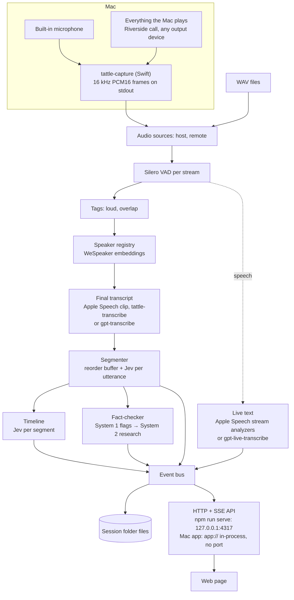

# Architecture

Tattle is an open-source Mac app: people download a signed, notarized build and it updates itself (see [The Mac app](desktop.md)); developers run the same engine and page from the project folder with `npm run serve` or `npm run app`. Either way, it has two parts. The **engine** — the Node engine plus two native helpers, `tattle-capture` for audio and `tattle-transcribe` for on-device transcription (macOS 26+) — owns everything that captures, thinks, and stores. The **front end** is a thin web page that only reads the engine's state and events and posts commands; it could be replaced (for example by a SwiftUI app) without touching the engine.

The engine runs in one of two hosts, with the same start-up (`bootEngine()` in `src/server/main.ts`) and the same router: **`npm run serve`**, a server on http://127.0.0.1:4317 for development and the command-line tools, or **the Mac app**, where it runs inside Electron's main process and the app's window reaches the router in-process, with no port (see [The Mac app](desktop.md)). Where the engine finds its files — the page, config, models, recordings, the helper — comes from `src/paths.ts`: the project folder by default, the app bundle and Application Support in the Mac app.

## Capture — `native/capture/` and `src/audio/nativeSource.ts`

`tattle-capture` is a Swift command-line helper (swift-tools 6.0, Swift 5 language mode) that uses Apple frameworks only:

- **`host`** — the MacBook's built-in microphone, chosen explicitly whatever the default input is, captured with `AVAudioEngine` (voice processing off, channel 0).
- **`remote`** — a private Core Audio tap (macOS 14.2+) of everything the Mac plays, read through a private aggregate device whose main sub-device is the current default output. When the default output changes (AirPods connect), the aggregate is rebuilt.
  - **The tap follows the apps playing sound** (`CATapDescription(monoMixdownOfProcesses:)`): every other process whose `kAudioProcessPropertyIsRunningOutput` is set. The list is updated in place (`kAudioTapPropertyDescription`), so the aggregate keeps running. Updates come from listeners on the process list and on each process's flag, plus a check every second, because a process can start playing before its listener is attached. An app that starts playing mid-session can lose up to about a second at its start; a call plays throughout, so this only touches the moment it begins. A failed update is a `warning` status line and is retried.
  - **Why not a global tap:** a global tap (`monoGlobalTapButExcludeProcesses: []`) captures the same sound, but on macOS 26.2 it made other apps hang when they started a microphone (see [Gotchas](gotchas.md#capture-macos)). `--tap global`, or `CONVERSATION_CAPTURE_TAP=global` in the environment of `npm run serve`, brings it back as a fallback. `started` reports the mode as `remote.tap`.
- **Output kind** — `started` and `device_changed` carry `remote.outputKind`: `speakers`, `headphones`, or `virtual` (`Devices.outputKind`). Bluetooth counts as headphones. A built-in output is headphones when its data source is `hdpn` or its name says "Headphones" (Apple silicon lists the jack as its own device, "External Headphones"), speakers when it is `ispk`. Anything else (USB, HDMI, AirPlay, aggregate) counts as speakers. A data-source listener reports a jack plugged in on Macs that switch the source rather than the device.
- **The mic watchdog** (`Mic.swift`) restarts the microphone's engine whenever no buffer has arrived for 1.5 s, and checks 0.5 s after every `AVAudioEngineConfigurationChange`, whatever `isRunning` says. It restarts at most 5 times a minute, then every 10 s until audio flows again; it never gives up. Each restart is a `warning` status line (see [Gotchas](gotchas.md#capture-macos)).
- **ClockLock** timestamps each buffer from its host time and keeps each stream's sample count within 20 ms of the session clock, inserting silence when a stream falls behind and dropping samples when it runs ahead, so sample index ÷ 16 = session milliseconds on both streams.
- **Stdout** carries binary frames only: `PCAP`, a stream byte (0 host, 1 remote), 3 reserved bytes, `sessionMs` (float64 LE), a sample count (uint32 LE), and that many PCM16 LE samples at 16 kHz (1,600 per frame, about every 100 ms). **Stderr** carries JSON status lines (`started` with `epochMs`, `device_changed`, `warning`, `error`).
- `--list-devices` prints input devices; `--probe <s>` prints peak and RMS levels (used by `capture:test` and `preflight`).

The Info.plist is embedded in the binary (`-sectcreate __TEXT __info_plist`), without which macOS refuses the permissions. macOS attributes both permissions to the app that launched the helper — the terminal app for `npm run serve`, Tattle itself for the Mac app, which declares the same two usage descriptions in its own `Info.plist` (see [The Mac app](desktop.md#macos-permissions)); a denied permission delivers silence, not an error (see [Gotchas](gotchas.md)).

The Node adapter spawns the helper, parses frames across partial reads, maps helper time onto the session clock (`started.epochMs − session start`), and re-chunks into 512-sample Float32 frames, filling gaps with silence. A malformed frame kills the helper; an unexpected exit is restarted up to 3 times per session, 1 s apart, with an `error` event each time, then the live sources end cleanly. Stopping closes stdin, then sends SIGTERM after 2 s and SIGKILL after 5 s.

`FileSource` plays WAV files as the same 512-sample frames — at real-time pace (`speed: 1`) or as fast as possible (`"max"`). Nothing downstream knows which kind of source it reads.

## The session pipeline — `src/pipeline/session.ts`

A `Session` wires everything together and runs until input ends or it is stopped:

1. **Merge.** Frames from both sources are merged in `sessionMs` order, so file streams stay aligned at any speed. Each frame is written to `host.wav` / `remote.wav` as received, after Pause and [speaker mode](#speaker-mode-the-echo-gate) have replaced muted audio with silence.
2. **VAD.** One Silero VAD per stream (threshold 0.5, 0.25 s minimum speech, 0.5 s minimum silence, 30 s maximum) cuts utterances at pauses, never at fixed intervals. Utterance ids (`u_<n>`) come from one session-wide counter.
3. **Tags.** `loud` — the utterance's RMS is at least 6 dB above the median of that stream's last 50 utterances. `overlap` — it overlaps an utterance on the other stream by at least 1 s (computed when the segmenter releases it).
4. **Speakers.** Local voice embeddings assign or create a speaker (see [Speakers](speakers.md)).
5. **Transcription.** Each utterance gets its final text from the session's engine, fixed when it starts: a clip through Apple Speech on this Mac, or an upload to OpenAI. While it is still being spoken, live text streams to the page (see [Transcription](transcription.md)).
6. **Segmenter.** A reorder buffer releases utterances in `startMs` order across both streams — when everything earlier has finished transcribing and the other stream has passed that time and is not mid-speech, or 8 s after transcription. Each non-filler utterance gets one Jev request carrying the `boundary` question and the System 1 fact-check questions; code closes segments (see [Jev](jev.md)).
7. **Timeline.** Each closed segment gets one Jev request with the session's label set, chosen when it starts and fixed for its run (see [Jev](jev.md#the-timeline-questions-per-segment-label-sets)).
8. **Fact-checker.** System 1 answers from step 6 flag claims; System 2 researches, audits, and rewrites (see [System 1 and System 2](system1-system2.md)).
9. **Stats** every 60 s and at the end (`src/pipeline/stats.ts`), in the shape of the session's label set (`version: 2`): its index (the built-in set's Off-topic: the share of the category's labelled time on its index options; also stored as `roganIndex`, which older pages read), each category's time per option, talk time per speaker with each `perSpeaker` marker's count and each score's duration-weighted average, one list per marker with `list: true`, fact-check totals, and cost. Stats stored by recordings made before label sets are converted when they are opened (`src/labels/legacy.ts`).

At end of input, in order: close the WAVs (their final headers are written at once, so the audio is complete however long the rest takes, or if the Mac app quits during it); flush every VAD; wait for transcriptions and the segmenter; close the open segment (`final: true`) and label it; drain research, audits, and rewrites for at most 180 s; emit `stats`; write `speakers.json`; emit `session.ended`.

## Event bus and API — `src/store/events.ts`, `src/server/main.ts`

Every result is an event with a payload checked against a zod schema (a failed check is logged, the event still goes out), a sequence number, and a timestamp. The bus keeps the session's history (replayed to every new SSE connection), and the session appends each event to `events.jsonl`. Four types are transient, streamed but never stored: `utterance.partial`; `call.started` / `call`, the live view of every Jev and System 2 call (the call logs on disk are their record); and `transcription.status`, the engine setting and Apple's model install progress, which belong to no session.

| Group | Events |
| --- | --- |
| Session | `session.started` (with `features` and `transcription: { engine, locale \| model }`), `session.ended`, `session.paused` / `session.resumed` (with the session time `atMs`), `echo.gate` (speaker mode on or off: `active`, `device`, `atMs`), `health` (per stream, every second: RMS dBFS, ms since last frame, utterances in the last minute, capture device; on the host in speaker mode, `echoMutedMs`) |
| Speech | `utterance.partial`, `utterance`, `utterance.failed` (a line not transcribed: `retrying`, `failed`, or `empty`; see [Transcription](transcription.md)), `speaker.created`, `speaker.updated`, `speaker.merged` |
| Timeline | `segment.closed`, `segment.labels`, `section.updated` |
| Fact-check | `claim.flagged`, `claim.duplicate`, `claim.repeat`, `claim.researching`, `claim.verdict`, `claim.dropped`, `claim.disputed`, `audit`, `s1.version`, `s1.memory` |
| Accounting | `cost`, `budget.exhausted`, `stats`, `error` |
| Calls (transient) | `call.started` (`system`: `s1` or `s2`, `purpose`) when a Jev or System 2 call is sent; `call` with the logged row when it completes (a Jev row also carries the question definitions, for display) |

The router (`createApiServer`) uses Node's `http` module and serves one session at a time (an `Engine` owns it). `npm run serve` listens on 127.0.0.1 only; the Mac app never listens: each request from its window reaches the same router over an in-memory stream pair (`src/server/inProcess.ts`, see [The Mac app](desktop.md#the-in-process-connection--srcserverinprocessts)).

| Method | Route | Does |
| --- | --- | --- |
| GET, POST | `/api/setup`, `/api/setup/keys` | The API keys: what is set and `required`, and saving checked keys. Until the keys the engine requires are set (OpenAI's, only when OpenAI transcribes), every other route but `/api/transcription`, `/api/about`, `/api/licenses`, and `/api/engine` answers 503 and the page shows only the setup screen (see [Setup](setup.md)) |
| GET, PUT, POST | `/api/transcription`, `/api/transcription/install` | The transcription engine (Apple Speech or OpenAI) and Apple's model: read it, change it (409 on air), retry the model's install (see [Transcription](transcription.md#choosing-the-engine--srcsettingsts)) |
| GET | `/api/events` | SSE: the session's events so far, then live |
| GET | `/api/state` | Full current state (or a recorded session's snapshot) |
| POST | `/api/session/start` | `{ mode: "live", mic?, name?, features?, labelSet?, stories? }` or `{ mode: "replay", dir \| sessionId, speed, name?, features?, labelSet?, stories? }`; `features: { factcheck?, labels? }` (booleans, both on by default; see [Features](#features-transcript-only-sessions)); `labelSet`: a label set's id (the built-in `ai-podcast` when absent, 400 for an unknown one), or `null` for labels off; `stories`: tonight's headlines. 400 `needsKey: "openrouter"` for a feature without the OpenRouter key, 400 `needsKey: "openai"` for the OpenAI engine without its key, 409 `preparing: true` while Apple's model installs |
| POST | `/api/session/stop` | Stop reading input; in-flight work completes. When the session ends, the engine serves it as an opened recording (see [Recordings](recordings.md)) |
| POST | `/api/session/pause`, `/api/session/resume` | Live sessions only: while paused, incoming audio is replaced by silence, so nothing is heard, transcribed, or spent, and the WAVs and session times stay aligned; Stop still works |
| GET | `/api/devices` | The helper's input devices |
| POST | `/api/speakers/:id/rename`, `/api/speakers/merge` | Speaker edits (see [Speakers](speakers.md)) |
| GET | `/api/speakers/suggestions?voices=` | Merge suggestions for the session on screen: which speakers are the same person, with a voice match and a confidence (see [Speakers](speakers.md)) |
| PUT | `/api/stories`; POST `/api/labels/relabel` | Tonight's stories, relabelling, for the session on air (see [Jev](jev.md)). A session's label set cannot change while it runs: `PUT /api/labels` is gone |
| POST | `/api/claims/:id/override`, `/api/s1/rollback` | Host dispute, System 1 rollback (see [System 1 and System 2](system1-system2.md)) |
| GET, POST | `/api/label-sets` | The label-set library: `{ sets: [{ id, name, description, builtIn, counts, perHourUsd, broken? }], boundary }` (the locked boundary question, for the editor to show); POST creates a set from the body (a new id from its name, `builtIn` dropped) → 201. None of the label-set routes needs an API key, on air or not |
| GET, PUT, DELETE | `/api/label-sets/:id` | One set; replace or delete a user set (409 for the built-in one, 404 for an unknown id, 400 with the reasons for an invalid set) |
| POST | `/api/label-sets/:id/clone` | A copy as the user's own set, named "<name> copy" → 201 |
| GET | `/api/label-sets/:id/export` | Downloads `<name>.tattle-labels`: the set as JSON, `application/octet-stream`, as an attachment |
| POST | `/api/label-sets/import` | The file's JSON → a new set with a new id, renamed "<name> (2)" if the name is taken → 201 |
| POST | `/api/label-sets/estimate` | A draft set → `{ ok, errors, tokens, perHourUsd, overLimit }`: the editor's live validation and cost |
| POST | `/api/label-sets/try` | `{ set, sessionId, minutes }` → `{ segments, labels, recording: { features, set, labels }, costUsd, failed, window }`: Try on a recording (see [Jev](jev.md#the-timeline-questions-per-segment-label-sets)). 400 `needsKey: "openrouter"` without the key, 409 on air; writes nothing into the recording |
| POST | `/api/label-sets/assist` | `{ conversationId, messages, draft }` → `{ reply, set, costUsd, spentUsd, capUsd, error? }`: one turn of Create with AI. 400 `needsKey: "openrouter"` without the key, 409 past the conversation's $1 cap |
| GET | `/api/stats` | Current stats |
| GET | `/api/calls?system=s1\|s2&limit=` | The session on screen's most recent Jev (`s1`) or System 2 (`s2`) call rows, oldest first, and the models its config named |
| POST | `/api/sessions/close` | Leaves an opened recording's view (back to no session); a session on air is not affected |
| GET | `/api/about` | The project's name, version (the root `package.json`'s `version`, the only place it lives), and license (`id`, `holder`, and the `LICENSE` text); the page shows the version in the settings menu's footer |
| GET | `/api/licenses` | The Licenses and Acknowledgements window's content: the app's license, every component of `THIRD_PARTY_NOTICES.md` by group, and the full texts they name (`src/licenses.ts`; see [The Mac app](desktop.md#licenses-and-acknowledgements--weblicenseshtml-srclicensests)). Open before the keys are set |
| GET | `/api/engine` | `{ startedAt, stale }`: `stale` is true when a `src/**/*.ts` file changed after the engine started; the page then shows a banner asking for a restart. Never in the packaged Mac app, which has no sources |
| GET, PATCH, POST, DELETE | `/api/sessions`, `/api/sessions/:id`, `/api/sessions/:id/open` | The recordings library (see [Recordings](recordings.md)) |
| GET, POST | `/api/sessions/:id/export`, `/api/exports/:token`, `/api/sessions/import` | Export and import a recording as one `.tattle` file (see [Recordings](recordings.md#export-and-import)) |
| GET, POST, PATCH, DELETE | `/api/chat/models`, `/api/chats`, `/api/chats/:id`, `/api/chats/:id/messages` (a server-sent event stream), `/api/chats/:id/stop` | The chat window, for the session on screen (see [Chat](chat.md)). Its POST routes answer 400 `needsKey: "openrouter"` without that key |

**Every request must come from the page itself** (`fromThisPage`): the `Host` must be `127.0.0.1` or `localhost`, which defeats DNS rebinding, and any `Origin` must match it, so another website open in the browser can neither read anything nor act, not even with the "simple" cross-site requests that skip CORS (a text/plain POST that would start a recording). Anything else gets 403 (added 27 September 2026, after a review found only the setup routes guarded). The page itself is served with a Content-Security-Policy (`PAGE_CSP`): scripts, fonts, media, and connections from its own origin only, inline styles allowed because the page sets them from code.

It also serves `web/index.html` at `/` and at `/recordings/<id>` (the page's own URLs), `web/licenses.html` at `/licenses`, and `web/styles.css`, `web/dist/**` and `web/fonts/**` as static files, confined to `web/` (inside the app bundle in the Mac app).

## Web front end — `web/`

Plain TypeScript compiled by `tsc` to browser ES modules (`npm run build:web`, run by `npm run serve`, `npm run app`, and `npm run dist:mac`) — no bundler, no framework, no chart library. `main.ts` first asks `GET /api/setup`: with a required key missing it shows only the setup screen ([Setup](setup.md)); otherwise it imports `app.ts`, which loads `GET /api/state`, then applies `GET /api/events`; every update is idempotent (by id, and audits by timestamp) because the stream replays history on connect.

The look is "On Air", modelled on TV broadcast graphics: one dark navy theme, Barlow Condensed for labels and Barlow for text (both self-hosted in `web/fonts/`, SIL Open Font License), drawn SVG glyphs for markers (no emoji), and angled straps instead of rounded cards. The layout is three rows:

- **Header (one row):** an ON AIR block, only while a session is capturing (On air, Paused, Replay, or Stopping; it wipes in like a breaking-news strap when a session starts, and with a recording open or no session the header starts at the strap), the session name (click it to rename the session in place: Enter or leaving the field saves, Escape cancels; the name goes to the session's `meta.json`), with a chip — Transcript only, No fact-check, or No labels — when the session runs without some [features](#features-transcript-only-sessions), the elapsed clock, a **Speakers** chip in speaker mode (see [Speaker mode](#speaker-mode-the-echo-gate)), stream meters with device and last-frame age (red when a stream's level stays at or below −50 dBFS for more than 10 s, or no frame arrives for more than 3 s; the host meter reads "muted · call playing" instead while speaker mode mutes it), the spend against the session cap (breakdown on hover, chat included; for an opened recording, labelled Cost: what that recording cost when it ran, plus any chats about it), and the controls: **Export** (a recording on screen) and **Import** (anything but a session on air; see [Recordings](recordings.md#export-and-import)), Start live (which first opens a window with the microphone, how many people are on the call — Any (each time the window opens) or 1–4, also used by replays; see [Speakers](speakers.md) — and the session's [features](#features-transcript-only-sessions)), Pause / Resume (live sessions), Stop (only while a session is on air), then **Chat** (an accent-outlined icon button, ⌘K; see [Chat](chat.md)), a replay popover (folder and 1× / max speed), and a settings cog. The header shows only what applies to the screen: with no session, Import, Start live, Chat, Replay, and the cog; on a recording, Export and Import join them; on air, Start live, Replay, Export, and Import give way to Pause and Stop, so Pause, Stop, Chat, and the cog always fit. Short of room, the stream meters narrow and the session name ends in an ellipsis; the controls never shrink. Below 1100 px wide, the on-air header puts the meters and controls on a second row rather than let them run off the right edge.
- **Transcript and fact-checks (two columns)**, split by a divider you can drag (25–75 %, arrow keys too; double-click resets; the split is remembered in the browser):
  - the transcript, caption style, with segment dividers (a tag per category of the session's label set, the first in its option's colour, then each marker's icon and the companies mentioned), live text, filters, and click-to-rename; a speaker's name tag appears once per run of consecutive lines, and inferred speakers show as a muted "name *". The filters sit on their own row: a chip per marker (all of the set's markers) in a row that scrolls sideways on one line, then, pinned on the right and always visible, **All speakers** and one dropdown per category ("All subjects", "All modes"; options sharing a `group` are offered together, as "AI (all)"). A speaker filter shows only that speaker's lines; a marker or category filter shows the matching segments' lines and dims the rest of the timeline;
  - the right column has three tabs. **Fact-check**: a solid verdict block (False, Supported, Misleading…, or Queued / Checking / Dropped), queued → researching → verdict steps, the restated claim, correction, sources, research latency, a repeat badge, and a "Host disputes" button; a tally of verdicts sits in the column header, and the most recently active card is on top.
  - **Fast · slow thinking**, written for an audience: System 1 (Jev) and System 2 (the configured model, GPT-6 Luna) side by side with their models, roles ("judges every line in under a second" / "researches only what System 1 flags"), calls, average time, cost per call, and total, joined by "flags claims" and "rewrites its questions". A system glows and reads Thinking while one of its calls is in flight, and the "flags claims" link animates while System 2 works. Then the cost of System 1's judgments against System 2's average ("N× cheaper with System 1"); a funnel from every line heard, to lines checked by Jev, flagged, researched by System 2, and verdicts, with each system's cost and time; and one row per claim showing its handoff (Jev's time and cost → System 2's time and cost → the verdict), which opens to both calls.
  - **Jev log**: every Jev call, newest first, in plain words: its session time, what it was for ("Line check", "Topic labels", "Rewrite test"), what Jev was shown, the decisive answers as sentences ("Checkable claim? No (8% yes)", "Worth checking? 0.0 of 4"), latency, cost, and what the app did next ("→ Flagged: sent to System 2", "→ Not flagged", "→ Already checked"). Clicking a call shows every answer (memory questions folded into one line) and the exact HTTP request and response (`POST …/alpha/decisions` with the model, state, and questions; `200 OK` with the answers and usage). A System 2 call shows the same way (`POST …/chat/completions`, with the system prompt folded).
- **URLs** (`web/src/router.ts`), so a refresh, a bookmark, or Back lands on the same view:

  | URL | Opens |
  | --- | --- |
  | `/` | Home: the session on air (live or replay), or none |
  | `/recordings/<id>` | That recording, opened read-only |
  | `?t=1:23:45` | The playback position in a recording (kept current on seeks, on pause, and every 5 s while playing) |
  | `?tab=thinking` · `?tab=jev-log` | The right column's tab (Fact-check is the default) |
  | `?panel=recordings` · `insights` · `speakers` · `labels` · `transcription` · `chat` · `keys` | The window that is open |
  | `?panel=insights&section=fact-checker` · `log` | The Insights tab (Overview is the default). The former windows' URLs, `?panel=stats`, `system-1`, and `log`, open their tab |
  | `?panel=chat&chat=chat_2` | A chat of the session on screen ([Chat](chat.md)) |

  The URL follows the screen: opening or leaving a recording, or a session ending as one, adds a history entry; tabs, windows, and the position update it silently. Opening a URL makes the screen match: on load it opens the recording it names (unless a session is on air, which is shown instead, with a message), and Back to `/` leaves the recording (`POST /api/sessions/close`). Loading `/` while the engine shows a recording puts that recording in the URL rather than closing it. Transcript filters, timeline zoom, and column and timeline sizes are browser preferences, not part of the URL.
- **Playback (recordings only, never on air):** a play/pause button, a speed picker (1×, 1.25×, 1.5×, 2×, 3×, 4×; voices keep their pitch), a volume boost (100–300 %, remembered in the browser), and the position, in the timeline's header (`web/src/player.ts`). The timeline is the progress bar: a yellow playhead moves with the audio and stays in view when zoomed; clicking the timeline outside segments and markers seeks there, and clicking a segment or marker seeks to its start. Every transcript timestamp becomes a button that plays from that line. Every jump, from either side, moves both at once, playing or paused: the transcript scrolls to the line at that time and the timeline brings the playhead into view. While playing, the line being heard is highlighted and kept centred, unless the reader scrolled in the last 4 s. Space plays and pauses. The audio is the recording's two streams mixed by the server (see [Recordings](recordings.md)).
- **Timeline (bottom, full width):** HTML lanes positioned in percent of the session length, drawn from the session's label set (`web/src/timeline.ts`): section brackets from its first category, one lane per category (named after it; options in their colours; the first lane tall, the second short), an inline-SVG chart with one line per score on 0–4 (the first in the heat colour, the second in the hype colour; no chart without scores), marker pins with each marker's icon, a dashed "in progress" block for the open segment, hatched paused stretches, the axis, and a now line. The label column and the lanes share row heights computed from the set. With labels off there is one lane of plain segments ("Segments"). The legend above lists each score's line and each marker's icon, on one line that scrolls sideways. Faded labels are dimmed; clicking a segment or marker jumps to the transcript. A dotted line follows the pointer with the exact time. Zoom with − / + / Fit or ⌘/Ctrl + scroll (a trackpad pinch), from the whole session down to about 30 s across; zoomed in, the strip scrolls sideways (the wheel scrolls through time), segment labels stay in view, axis ticks adapt to the zoom, and a live session stays pinned to the newest moment while scrolled to the end. Dragging the strip's top edge (or its arrow keys) makes the heat · hype chart taller or shorter; double-click resets it, and the height is remembered in the browser.
- **Settings (the cog menu), each in a modal:** Recordings, **Insights**, Speakers (rename, merge), **Labels** (the label-set library, below), **Transcription** (Apple Speech on this Mac or OpenAI, with the model's state; read-only on air; its summary is "On this Mac" or "OpenAI"; see [Transcription](transcription.md)), and API keys (replace a key, both optional; see [Setup](setup.md)). Each item has a one-line summary; Insights' is the label set's index (for the built-in set, "Off-topic 12%"), the flag count, and the error count in red when there are errors. Speakers acts on the session on screen, so with none (nothing on air and no recording open) it is greyed out, reading "Start or open a recording", and a URL naming it opens nothing. Labels works at any time; its summary is the number of sets. Its footer shows the version and a **Licenses** link, which opens the Licenses and Acknowledgements page (`/licenses`: a new tab in a browser, its own window in the Mac app). In the Mac app the menu bar can open these windows too (**Settings…** opens API keys), through `window.desktop` (`web/src/desktop.ts`; see [The Mac app](desktop.md#the-bridge-to-the-page--desktoppreloadts-websrcdesktopts)). The Mac app leaves out what its menu bar has: API keys (**Settings…**), the footer (**About** and **Help → Licenses and Acknowledgements**), and the Replay-a-folder button, a developer's tool whose folder is relative to the project (`body.in-app .browser-only`, set in `web/src/main.ts`).
- **Insights (since 28 September 2026), one window with three tabs:** what the session on screen produced, how the fact-checker did, and what went wrong. They were three windows (Stats, System 1, Log) that repeated each other's fact-check counts. Speakers and Labels stay windows of their own, because they edit rather than report.
  - **Overview**, in the shape of the session's label set: its index as the big number ("Off-topic index: time spent on personal life and other topics"), each category's split as a bar in its options' colours, a table with each speaker's talk time, each `perSpeaker` marker's count ("Disagreements"), and each score's average ("Hype 1.8 / 4"), and one list per marker with `list: true` (the built-in set's predictions, recommendations, and clip-worthy moments; each jumps to its segment). Updated every minute and at the end.
  - **Fact-checker:** System 1's active version and memory questions; flags, good flags, false alarms, misses, and repeats; the verdicts, System 2's research (researched, duplicates, dropped), and rewrites promoted and rejected (from the stats); the last promotion or rejection with its gate; rollback. It says so when fact-checking is off. What the Fast · slow thinking tab shows (calls, times, costs) is not repeated.
  - **Log:** the last 30 errors; the tab carries their count, in red.
- **Labels (since 29 September 2026), the label-set library** (`web/src/labels.ts`), laid out like Recordings: every set with its description, "2 categories · 2 scores · 6 markers", and its estimated Jev cost an hour, the built-in one first with a **Built-in** badge. A built-in set has **Clone** and **Export**; the user's own have **Edit**, **Export**, and **Delete** (after an in-page confirmation: recordings made with a set keep their own copy), and clicking a name renames it. **New** opens the editor on an empty set, **Import** takes a `.tattle-labels` file (dropping one on the page does the same), and **Create with AI** opens a large window with a chat on the left (GPT-6 Luna, fixed) and the draft in the editor on the right: a reply that carries a set replaces the draft, the host can edit it at any time, the next message sends it as edited, and the running cost shows under the chat ("Spent $0.01 of $1.00"). Without the OpenRouter key the chat side shows the key's card instead, as Chat does. A file that fails validation is listed as broken, with the reason. Sets are files in `~/Library/Application Support/Tattle/labels`, shared by development and the Mac app; nothing here needs a key or calls a model.
  - **The editor** (`#dlg-labelset`, a large modal over the library) edits every field of a set: name, description, prefix, companies, the fade confidence; up to 2 categories (name, question, options with a colour from a 12-colour palette or a hex value, a description Jev reads, and an optional group; an optional index over some options); up to 2 scores (name, question, 5 levels); up to 8 markers (name, short name, an icon from a grid of the 30, question, optional yes and no wording, a threshold slider from 0.50 to 0.95, "count per speaker", "list in Insights"). Ids are derived from names (snake_case). Add buttons say how many are left ("1 of 2") and turn off at the limit; the palette and the icon grid open inside the dialog. The locked boundary question is shown read-only. 500 ms after each change the draft goes to `POST /api/label-sets/estimate`: its errors are listed, Save waits until there are none, and the footer reads "About $0.01 per hour · 2,369 tokens per call of 32,000". A folded **How to write good labels** gives the rules learned from Jev (one narrow judgment, concrete yes and no wording, options that do not overlap, thresholds away from where answers cluster). The built-in set opens read-only with **Clone to edit**.
  - **Try on a recording** (the editor's footer, and Create with AI's) opens a window over the editor: pick a recording, then **Try it · about $0.004 at most**, and see two still timelines of its first 10 minutes stacked, the recording's own labels and the draft's, with the cost. A recording made with labels off shows the draft alone, with a note (for a transcript-only one, that its segments were cut at pauses). Without the OpenRouter key the window asks for it in place.
- **Chat**, a large modal from the header: questions about the transcript to any curated OpenRouter model, like ChatGPT with the transcript as its only attachment (see [Chat](chat.md)).

**Every control is bespoke; none is the browser's own.**

- Renames, merges, disputes, deletes, and replay confirmations use an in-page dialog rather than the browser's `prompt()` and `confirm()`, so they read well on a shared screen.
- `web/src/ui.ts` upgrades every `<select>` on the page, including ones rendered later (a `MutationObserver` watches the page), into a styled button and listbox.
  - Keyboard: ↑ ↓, Home, End, Enter, Space, Esc, and type-to-jump.
  - The native select stays in the DOM, hidden, as the source of truth. Page code keeps using a plain `<select>`: it reads and sets `.value`, replaces `<option>`s, and listens for `change`.
- `title` attributes show as styled tooltips instead of the browser's own. The text moves to `data-tip` and `aria-description` on first hover or keyboard focus.
- Text fields get `autocomplete="off"`, so no browser autofill dropdown appears.
- The Jev log's folded prompt draws its own caret.
- Lists and tooltips are top-layer popovers, so they show above modals. A list opened from a control inside an open modal is appended to that dialog, not to `<body>`: a modal makes everything outside it inert, so a list outside the dialog shows but ignores clicks (before 27 September 2026 the Start live window's microphone could not be chosen with the mouse). The Start live window reloads the microphone list each time it opens, so earbuds or a USB mic connected after the page loaded appear, and it preselects the microphone used last time (remembered in the browser) when it is still connected. The page is laid out to be legible when shared as a window in Riverside at 1280 × 720.

## Features: transcript-only sessions

A session runs two features beyond its transcript, **fact-checking** (System 1 and System 2) and **labels** (Jev labels each closed segment). Both are on unless the start request turns them off (`features` in `POST /api/session/start`; `Features` in `src/pipeline/session.ts`). A session's features are fixed for its whole run: no command turns a feature back on. They are recorded in `session.json`, `session.started`, and `GET /api/state` (`session.features`); a recording from before features existed ran with both on.

| Features | What runs | Jev per line (`utterance`) | Jev per segment | System 2 |
| --- | --- | --- | --- | --- |
| Both on (default) | Everything | `boundary` + System 1 + memory | Timeline labels | Research, audits, rewrites |
| Fact-check off | Transcript, timeline labels | `boundary` only (version `off`) | Timeline labels | Never |
| Labels off | Transcript, fact-checks | `boundary` + System 1 + memory | Never; segments are kept, unlabelled | As usual |
| Both off ("transcript only") | Transcript, segments, chat | **Never** | Never | Never |

- **Segments without Jev.** With both features off, Jev is never asked. The segmenter closes a segment at a pause of at least `segmentation.pauseBoundaryMs` (2 s), once the segment is at least `minSegmentMs` (12 s) long, and before it would pass `maxSegmentMs` (75 s, marked `forced`). So the timeline still divides the show into stretches to jump between.
- **What still works:** capture, transcription and live text, speakers, the timeline's segments and playhead, Pause, Resume, Stop, recordings and playback, and [Chat](chat.md).
- **Refused commands:** for a feature that is off, the engine answers 409 ("labels are off for this session", "fact-checking is off for this session"). This covers `PUT /api/stories`, `POST /api/labels/relabel`, `POST /api/claims/:id/override`, and `POST /api/s1/rollback`.
- **The page:**
  - **Start live** opens a window with the microphone and people-on-the-call pickers, the **Fact-check** switch, a **Labels** picker (every usable label set by name, then **Off**), and **Tonight's stories (optional)**, one headline per line, shown only when a set is picked. With the OpenRouter key set, fact-checking starts on and the picker on the set used last time (remembered in the browser; the built-in one when that set is gone); without it, both start off, and turning either on asks for the key in the window (see [Setup](setup.md#asking-for-a-key-where-it-is-needed)); **Not now** puts both back off. Start sends `features`, `labelSet` (the set's id, or `null` for Off), and `stories`. It shows an estimated cost per hour: the transcript is free on this Mac with Apple Speech ("Free: nothing leaves this Mac" with both off) and about $1.23 with OpenAI, about $0.03 for Jev's line checks, the picked set's own estimate (about $0.01 for the built-in one), and up to $0.35 more for fact-checking. With Apple Speech, Start waits for the on-device model ("Getting on-device speech recognition ready… 42 %", with Try again on an error).
  - The header chip names what is off.
  - The Fact-check tab, Fast · slow thinking, the Jev log, System 1, and Labels say why they are empty.
  - With labels off, the transcript's marker and category filters and the timeline's legend give way to "Labels off for this session", and the timeline shows one lane of plain segments.
- **Replays** run with both features on unless their start request says otherwise. From the page (the replay popover, Recordings → Replay), a replay runs fact-checking and the label set picked last time when the OpenRouter key is set, and is transcript-only when it is not.

## Speaker mode: the echo gate

With earbuds, the microphone never hears the call. When the call plays through the Mac's speakers, the microphone picks it up too, and each guest line used to be transcribed a second time, on the host's stream, as the host's (the host stream is limited to 1 voice). It was also sent to Jev and fact-checked twice.

**Speaker mode** mutes the microphone while the call plays. It never subtracts the echo: Apple's voice processing only cancels audio its own process plays (not Riverside's) and turns every other app down by about 15 dB, and a hand-built echo canceller leaves an echo tail on laptop speakers.

- **When it is on.** Live sessions follow the helper's `remote.outputKind` (see [Capture](#capture--nativecapture-and-srcaudionativesourcets)). It is on for `speakers` and off for anything else, and switches mid-session when the output changes. The engine passes it to `Session.setOutput`, which emits `echo.gate` on each change. Replays never turn it on by themselves.
- **What it does** (`src/audio/echoGate.ts`). A remote frame at or above `echoGate.thresholdDbfs` (−45) marks the call as playing. Every host frame is replaced by silence while the call plays and for `echoGate.holdMs` (250 ms) after, which covers room echo and the speakers' delay. The call reaches the tap before its echo reaches the microphone, and frames are merged in session-time order, so the gate is closed before the echo arrives.
- **It cannot stay stuck on.** It keeps no "muted" flag: each host frame is judged against the time of the last loud call frame, so the microphone is back within `holdMs` whenever the call goes quiet, fails, or its stream ends. It also stays open when a call frame is stamped more than 1 s ahead of the host frame (clocks disagreeing), and it opens at once when the output becomes anything but speakers. The helper reports the new output even when rebuilding the tap for it fails, so a failed rebuild cannot leave speaker mode on after earbuds connect. A device the helper cannot classify counts as not speakers: the microphone stays open.
- **Inactive, it changes nothing.** Every host frame goes through untouched: with earbuds the pipeline, the recorded audio, and every result are what they were before speaker mode existed (tested).
- **What is stored is what was heard.** The muted stretches are silence in `host.wav`, as for Pause, so playback matches the transcript.
- **The cost.** It is half duplex: anything the host says while a guest is talking, and the first quarter-second after a guest stops, is not heard. A guest's "mm-hmm" while the host talks cuts a hole in the host's line, which may split it in two. Earbuds are still the recommended setup, and the page says so.
- **Configuration** (`config/app.json` → `echoGate`). `mode` is `auto` (the default), `always` (every session, replays included, for trying it on a recording made on speakers), or `never`. `thresholdDbfs` and `holdMs` are described above.
- **The page.** A **Speakers** chip next to the stream meters, only while a live session is in speaker mode (just the glyphs below 1180 px). Its info box, on hover or keyboard focus, explains why the microphone is muted and recommends earbuds. The host meter reads "muted · call playing" instead of its level, in orange, and does not turn red for silence while it is muted. The chip is static markup, only shown and hidden, because the meters are rebuilt every second and would close the info box under the pointer.

## Budgets — `src/budget.ts`

One ledger per session, plus the development total read from the recordings folder's `**/*.jsonl` (`sessions/` in development) when the session starts. Every external call runs `assertCanSpend` before and `record` after — live text checks when it opens a connection and at every committed turn — in four buckets (`transcription` — final and live, `jev`, `s2`, `chat`), which drive the `cost` event. `chat` is in the session's total but not in the session cap's count: it has its own cap per recording, `chat.capUsd` ($2), so a chat never stops the pipeline (see [Chat](chat.md)).

- **Session cap** (`budget.sessionCapUsd`, $10) — always enforced. It was $5 until 25 September 2026; raised so a long or busy show never stops mid-air.
- **Development cap** (`budget.devCapUsd`, $3) — the total of `cost_usd` over call rows in `sessions/**/*.jsonl` (including `sessions/deleted-spend.jsonl`, which keeps the spend of deleted recordings), enforced by replays (including `serve --replay`) and `smoke`, not by live sessions or `preflight`. `--allow-over-dev-cap` lifts it. The packaged Mac app never enforces it: it guards a developer's replays, and the app's users have the session cap.
- When a cap is reached, or OpenRouter returns a non-transient 402, `budget.exhausted` is emitted and further calls are refused.

## Configuration — `config/`

`src/config.ts` validates these files with zod at startup; code never writes to them at runtime. The Mac app ships them inside the app, read-only: changing them means building the app again (see [The Mac app](desktop.md)).

| File | Holds |
| --- | --- |
| `config/app.json` | Server port (`npm run serve` only), budgets, VAD, echo gate (speaker mode), speakers, transcription (OpenAI's final and live layers, Apple's clips), Jev client, segmentation (including `pauseBoundaryMs`, used only without Jev), System 2, fact-check loop, chat |
| `config/timeline.json` | The locked questions, the same for every label set: `boundary` (asked per utterance, calibrated) and the wording of the `story` question |
| `config/labels/*.json` | The built-in label sets, read-only (`ai-podcast.json`, the default); the user's own live in Application Support (see [Jev](jev.md#the-timeline-questions-per-segment-label-sets)) |
| `config/factcheck.s1.default.json` | System 1's default question set and thresholds (`s1@1`) |

The API keys are not in `config/`: they come from the environment (`.env`, in development) or `~/Library/Application Support/Tattle/credentials.json` (see [Setup](setup.md)). Neither is the transcription engine, a user setting in `settings.json` next to them (see [Transcription](transcription.md)).

Validation rejects, among others, `minSegmentMs > maxSegmentMs`, a label set over its limits (2 categories, 2 scores, 8 markers, 5 levels) or with a category lacking a `none` / `other…` option, non-snake_case ids, and a System 1 set whose `claim_type` does not have exactly its 7 keys.

## Tests

`npm test` runs offline: `tests/setup.ts` replaces `fetch` with a function that throws, and every client takes its `fetch` (or WebSocket) through its constructor so tests pass fakes. The suite covers audio and VAD on the fixture, speakers, transcription, live text, the Jev client's retry rules, the segmenter, the fact-checker loop and gate, the timeline, stats, the capture adapter and Apple Speech (each with a fake helper process), the engine setting and the key gate, the HTTP API, the library, and an end-to-end session with fake services that also checks no API key reaches any file or event. `npm run smoke` and `npm run preflight` are the live checks.

Related: [Setup](setup.md), [Mission](mission.md), [Jev](jev.md), [System 1 and System 2](system1-system2.md), [Transcription](transcription.md), [Speakers](speakers.md), [Recordings](recordings.md), [Chat](chat.md).
