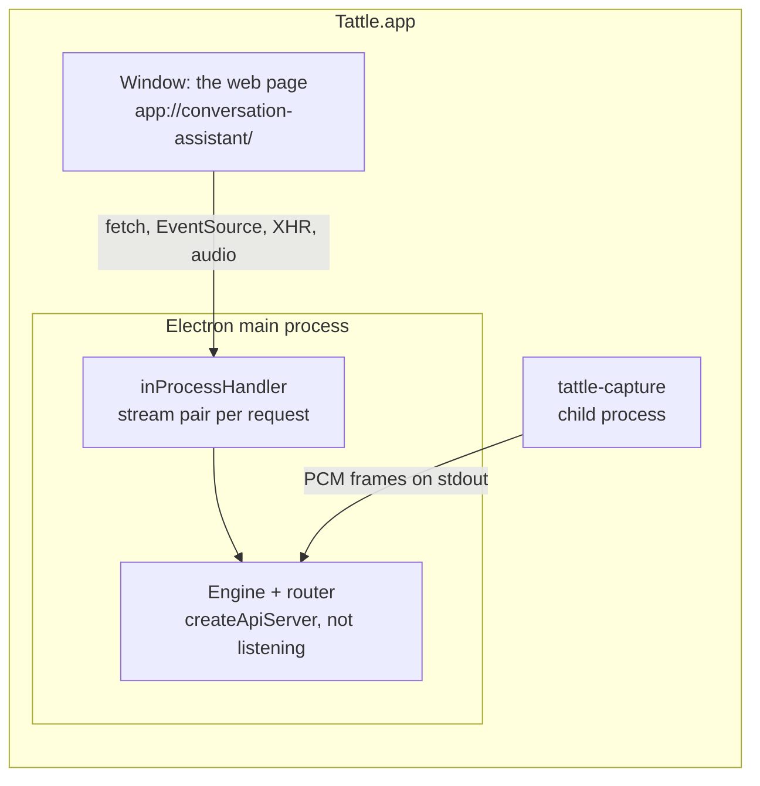

# The Mac app

Tattle ships as a Mac app for people who never open a terminal: download the DMG, drag the app to Applications, open it. It is the same engine and the same web page as `npm run serve`, packaged with Electron (added 27 September 2026). Developers keep running `npm run serve` and the CLI tools as before.

It is distributed by direct download, signed with a Developer ID and notarized by Apple, not through the Mac App Store: the App Store requires the App Sandbox, which the system-audio tap, the capture helper, and `afconvert` would all have to live within.

## How it runs: one process, no port

- **The engine runs inside Electron's main process** (`desktop/main.ts` calls `bootEngine()` from `src/server/main.ts`, the same start-up `npm run serve` uses). Electron 44 bundles Node 24, the version the engine needs.
- **The page loads from `app://conversation-assistant/`**, a private scheme registered as standard, secure, fetch-capable, and streaming. `protocol.handle("app", …)` passes each request to `inProcessHandler` (`src/server/inProcess.ts`), which feeds it to the unchanged router over an in-memory stream pair (`stream.duplexPair()` with `http.request({ createConnection })`) and streams the response back. JSON, server-sent events, Range requests for playback, uploads, and downloads all work unchanged, and the page's relative URLs (`fetch("/api/state")`) need no change.
- **No TCP port.** Nothing listens, so nothing can collide with another program (4317, the port `npm run serve` uses, is also OpenTelemetry's default), and no other program or website can reach the engine. The address never changes, so the page's saved preferences and `/recordings/<id>` links survive restarts.
- **The capture helper** is a child process, as with `npm run serve`; it only writes audio to a pipe.

### The in-process connection — `src/server/inProcess.ts`

- **Closes are linked across the pair.** `duplexPair()` does not pass one side's close to the other. Without the link, a page closing `/api/events` (a reload, or leaving) left the router subscribed and writing to a dead stream for good (tested in `tests/inProcess.test.ts`).
- **One pair per request:** `Connection: close`, so each pair closes when its response ends.
- **The router's guard.** Every route answers only the page itself: a `Host` of this machine, and an `Origin` that matches it (`fromThisPage`; see [Architecture](architecture.md#event-bus-and-api--srcstoreeventsts-srcservermaints)). The window's `Origin` is `app://conversation-assistant`, so the handler presents each request as `Host: 127.0.0.1` with no `Origin`. That is true by construction: only the app's own window reaches this handler.
- The page comes with the router's Content Security Policy (`PAGE_CSP` in `src/server/main.ts`, the same as with `npm run serve`): scripts, fonts, media, and connections from the app only; inline styles allowed, because the page sets styles from code.

## Where the app keeps its files — `src/paths.ts`

`appPaths()` says where the engine finds everything. Its defaults are the project folder's, which `npm run serve`, the CLI tools, and the tests use unchanged. The packaged app calls `setAppPaths()` before the engine starts. Every consumer reads the paths at each use, never at import, so the call always applies.

| Path | `npm run serve` / CLI / tests | The Mac app |
| --- | --- | --- |
| `root` (`package.json`, `LICENSE`) | the project folder | inside `app.asar` (`app.getAppPath()`) |
| `web`, `config`, `models` | `web/`, `config/`, `models/` | `Contents/Resources/…`, read-only |
| `helper` | `native/capture/.build/release/tattle-capture` | `Contents/Resources/bin/tattle-capture` |
| `sessions` | `sessions/` | `~/Library/Application Support/Tattle/sessions` |
| `notices`, `licenses` (the Licenses window) | `THIRD_PARTY_NOTICES.md`, `licenses/` | `Contents/Resources/licenses/THIRD_PARTY_NOTICES.txt`, `Contents/Resources/licenses/` |
| `src` (the restart banner's watch) | `src/` | none: `/api/engine` never reports stale |

- `~/Library/Application Support/Tattle/` (`appSupportDir()`) also holds `credentials.json`, the keys saved from the setup page ([Setup](setup.md)), and `Window/`, the window's own storage (the preferences the page remembers). The app's working directory is set there too, so anything still relative lands there, never in `/`.
- The config is read-only in the app. Label edits never needed to write it: they are saved in each recording ([Recordings](recordings.md)).
- **Recordings made with `npm run serve` stay in the project's `sessions/`.** To see them in the app, move the folders into the app's `sessions/` folder (**File → Show Recordings in Finder**), or export and import them.
- The packaged app never enforces the $3 development cap ([Architecture](architecture.md#budgets--srcbudgetts)): it guards a developer's replays, and the app's users have the per-session cap.
- `npm run app` (Electron from the project folder) keeps the project's paths, like `npm run serve`, with `root` set to the project and `src/` watched: the engine is bundled at build time, so an edit under `src/` needs `npm run app` again, and the page says so.

## The window — `desktop/main.ts`

- **One instance.** Opening the app again focuses the open window.
- **Closing the window keeps the app running**, and any show on air with it, as Mac apps do. The Dock icon reopens it.
- **Links to other sites** (the key setup steps, fact-check sources) open in the default browser (`setWindowOpenHandler`). Any other navigation away from `app://conversation-assistant/` is refused.
- **Exports** are saved to Downloads, like a browser: `<name>.tattle`, then `<name> (2).tattle` if taken. The Dock's Downloads stack bounces when one finishes.
- **Imports** (the Import button, or a file dropped on the window) work as in a browser. The upload is in-process and instant, and the scheme reports no upload progress, so the progress bar moves back and forth while the recording is unpacked (`web/src/transfer.ts`).
- **No browser permissions** but the clipboard: Electron grants a page any permission it asks for unless told otherwise, so the window refuses them all except `clipboard-sanitized-write` (the chat's Copy buttons). Capture never goes through the page.
- **No DevTools in the packaged app** (`webPreferences.devTools`): code pasted into its console would run with the app's microphone grant. `npm run app` keeps them.
- **Every dialog is a sheet on the window** (`ask()`). A dialog without a window runs macOS's modal loop (`NSAlert runModal`), which stops the main process until it is answered, and with it the engine: a show on air would stop being captured (see [Gotchas](gotchas.md#mac-app-electron)).

## The menu bar — `desktop/main.ts`

Since 28 September 2026 the app menu is the app's own, as in a native Mac app, not Electron's stock one:

| Menu | Items |
| --- | --- |
| Tattle | **About Tattle** (macOS's panel: the version, the copyright and license, and where the licenses are), **Check for Updates…** (below), **Settings…** (⌘,), then the standard Services, Hide, Hide Others, Show All, and Quit |
| File | **Show Recordings in Finder**, Close |
| Edit, View, Window | The standard ones |
| Help | **Tattle on GitHub**, **Licenses and Acknowledgements** (below) |

**Settings…** opens the API keys window ([Setup](setup.md)), the page's `?panel=keys`. The app's own windows (Recordings, Insights, Speakers, Labels) stay in the page's settings cog, not in the menu bar: the menu bar holds what is about the app (its version, updates, the API keys, the licenses), and the cog what is about the show, one click away in the window shared on air. So in the Mac app the cog leaves out what the menu bar has: API keys, the footer's version and Licenses link, and the Replay-a-folder button (see [Architecture](architecture.md#web-front-end--web)). In a browser (`npm run serve`), which has no menu bar, the cog keeps them all.

### The bridge to the page — `desktop/preload.ts`, `web/src/desktop.ts`

The page runs sandboxed with context isolation, so a menu item cannot reach it directly. A preload script (bundled on its own to `dist/desktop/preload.cjs`, CommonJS as a sandboxed preload must be) gives the page `window.desktop`, with two functions:

- **`onCommand(cb)`: the menu bar to the page.** A command is the URL name of one of the page's windows (`web/src/router.ts`'s `PANELS`), and `app.ts` opens that window (closing any other). A command sent before the page listens waits in the preload: **Settings…** with the window closed reopens it, and the command is delivered once the page has loaded. The setup screen never listens, since it already is the keys screen.
- **`run(request)`: the page to the app,** for what only the app can do: `open-licenses`, `open-chromium-licenses`, and `show-license-files`. `desktop/main.ts` answers only these three, and only from a page of the app's own origin.

In a browser `window.desktop` is undefined, and the page does without: the cog's **Licenses** link opens `/licenses` in a new tab instead.

## Licenses and Acknowledgements — `web/licenses.html`, `src/licenses.ts`

**Help → Licenses and Acknowledgements** (and, in a browser, the cog menu's **Licenses** link) opens the licenses in a window of the app's own, which stays open beside the main one, instead of sending the files to TextEdit and the browser as before 28 September 2026. It is a second page of the app, `/licenses`, reading `GET /api/licenses` (open before the keys are set, so it works on the setup screen too):

- A list, with a search: **This app** (the `LICENSE` text, with the version and holder), then every component in `THIRD_PARTY_NOTICES.md`: "Built into the app" (Electron, its update frameworks, sherpa-onnx, eSpeak NG, ONNX Runtime, the two models, the fonts) and "npm packages", each with the license on its first line. ↑ and ↓ move through it.
- A component shows its notice (Markdown, with its links opening in the browser) and, below, the full texts it names (`licenses/GPL-3.0.txt`, `web/fonts/OFL.txt`…), folded when longer than 60 KB (ONNX Runtime's own third-party notices are 338 KB).
- `src/licenses.ts` splits the notices at their `##` groups and `###` components, never at a heading inside a code block (sax's Blue Oak license has its own `##` headings), and reads the files on each request, like `/api/about`, so the window shows exactly what ships.
- In the app, the window adds **Chromium, Node.js, FFmpeg**, which opens `LICENSES.chromium.html` in the browser (20 MB, too large for the window), and **Show license files in Finder** (`Contents/Resources/licenses/`).

## macOS permissions

macOS asks for **Microphone** and **System Audio Recording** the first time the capture helper starts, and gives both to the app: it attributes the helper's requests to the app that launched it (verified in macOS's permission log, `tccd`). System Settings → Privacy & Security lists **Tattle**, not Terminal.

- **First launch.** When the microphone permission is undetermined, the app shows a sheet, "Tattle needs two permissions", then starts the helper for a moment (`--probe 1`), so macOS asks both questions now rather than at the start of a show.
- **A refused microphone.** At each launch, the app offers to open System Settings at Privacy & Security → Microphone. A refused System Audio Recording cannot be detected before a session: it records silence, which the page's stream meter shows in red ([Architecture](architecture.md#web-front-end--web)).
- **Grants follow the signature.** macOS ties them to the app's code signature, so every version must be signed with the same Developer ID, or an update loses them. Ad-hoc test builds (below) are a different app to macOS.
- **In development** (`npm run app`, or `npm run serve`), macOS still asks on behalf of the terminal that started it, so the first-launch sheet is skipped.

## A show in progress

- **The Mac stays awake:** a `prevent-app-suspension` power-save blocker runs from `session.started` to `session.ended`.
- **Quitting** (⌘Q, or restarting for an update) while a session is on air asks first. **Stop and Quit** stops the session and waits up to 30 s for it to end. The audio is complete within seconds, because the session writes its WAVs' final headers as soon as its input ends (`SessionStore.closeAudio`, at the start of the session's ending), before transcriptions and fact-checks drain. Lines still in flight may be lost; pressing Stop and waiting keeps them.
- **Updates are never looked for or downloaded while a session is on air** (below).

## Updates

`electron-updater` checks the project's GitHub Releases (`publish` in `electron-builder.yml`: `nicolasdao/tattle`) at launch and every 4 hours, only in the packaged app and only while nothing is on air, so a download never competes with a live call. It downloads the new version's zip in the background (only the changed blocks, using the `.blockmap` files) and installs it when the app quits. When a download is ready and nothing is on air, a sheet offers **Restart Now** or **Later**, once per version.

**Check for Updates…** (the app menu, since 28 September 2026) says what it finds, each time on a sheet:

| Situation | The sheet |
| --- | --- |
| Nothing newer | "You're up to date", with the version |
| A newer version | "A new version is available", with both versions: **Download and Install**, **Later**, or **Release Notes** (the release's GitHub page; the sheet comes back) |
| Downloading | No sheet: the menu item reads "Downloading 0.6.3… 45%" (greyed, in steps of 5 %) and the Dock icon shows a progress bar; when it is done, the Restart Now / Later sheet |
| Already downloaded | The Restart Now / Later sheet again, even after Later |
| A session on air | "Updates wait until the show ends", with the version |
| No connection, or a GitHub error | "Can't check for updates right now", with the reason, or "The download failed" |
| `npm run app` | "Updates come only to the installed app" |

So `autoDownload` is off, and `desktop/main.ts` starts each download itself: at once after an automatic check (the behaviour before), on **Download and Install** after a manual one. While a check or download runs, the item is greyed ("Checking for Updates…").

Tested with `npm run app` on 28 September 2026: the menus, **Settings…** (also with the window closed), the development sheet, and the Licenses window. The other sheets need a signed build, and a newer published version for the download ones: not tested yet.

- It needs a signed app: macOS refuses to update an ad-hoc build.
- It reads `latest-mac.yml` from the newest published (not draft, not pre-release) GitHub Release.
- Installed copies look for updates in the repository they were built with. Since the rename to Tattle it is `nicolasdao/tattle`, which GitHub renamed from `nicolasdao/conversation-assistant`: GitHub redirects the old name to the new one, so copies built before still find new releases, as long as no repository is ever created under the old name again. Earlier, on 28 September 2026, that repository was recreated with a rewritten history (private details removed from old commits; the first public one had been renamed and made private), under the same name, so copies installed before still find new releases. GitHub keeps the tag name of an immutable release reserved even across such a move, so the rewritten `v0.6.0` could not be pushed: 0.6.0 has a changelog entry and a local tag but no tag or release page on GitHub; 0.6.1 was tagged but never published (a release check caught an error); 0.6.2 is the first published release. If it moves again, change `publish` in `electron-builder.yml` and the `REPO` link in `desktop/main.ts`, and keep publishing to the old repository until installed copies have updated.

## The name, and what kept the old one

The app was called Conversation Assistant before 0.8.0 (and Podcast Assistant before that), and is now **Tattle**. The names people see changed everywhere: the app and its menus, the DMG, the permission prompts, the capture helper (`tattle-capture`), exports (`.tattle`, while the older extensions still import, see [Recordings](recordings.md#export-and-import)), and the repository. Four identifiers kept the old name on purpose, because changing any of them breaks something for people who already have the app:

| Kept | Where | Why it can never change |
| --- | --- | --- |
| The bundle id `com.cloudlesslabs.conversation-assistant` | `appId` in `electron-builder.yml` | macOS ties the Microphone and System Audio Recording grants to it, and an update installs only over an app with the same one: a new id is a different app to macOS |
| The page's address `app://conversation-assistant` | `ORIGIN` in `desktop/main.ts` | The window's storage (the preferences the page remembers) is kept per address |
| The notary keychain profile `conversation-assistant` | `scripts/build-mac.sh`, the release skill | Saving it again needs the App Store Connect key file (`.p8`), which Apple gives out only once |
| The helper's bundle id `com.cloudlesslabs.conversation-capture` | `native/capture/Info.plist` | An id, never shown; nothing gains from changing it |

**The data folder moves once.** At launch (the Mac app, and `npm run serve`), `migrateAppSupportDir()` in `src/paths.ts` renames `~/Library/Application Support/Conversation Assistant/` to `~/Library/Application Support/Tattle/` when only the old one exists, so the keys, the recordings, and the window's storage come along. It never touches a `Tattle` folder that exists already.

**Installing over the old app.** An auto-update keeps the app's file where it was, so an updated copy can stay `Conversation Assistant.app` in Applications while it shows Tattle everywhere else. Installing the DMG gives `Tattle.app`; delete `Conversation Assistant.app` then, since two copies of one bundle id confuse macOS about which one to open and update.

## Building

| Command | Does |
| --- | --- |
| `npm run app` | Builds the page and the bundle, then opens the app from the project folder (development) |
| `npm run build:desktop` | Bundles `desktop/main.ts` and the engine with esbuild into `dist/desktop/main.mjs` (ESM; `electron`, `electron-updater`, and `sherpa-onnx-node` stay external), and `desktop/preload.ts` into `dist/desktop/preload.cjs` |
| `npm run dist:mac` | `scripts/build-mac.sh`: the models if missing, the capture helper, the page, the bundle, then electron-builder into `out/` |

`npm run dist:mac` writes `out/Tattle-<version>-arm64.dmg` (what people download), `out/Tattle-<version>-arm64-mac.zip` (what updates download), their `.blockmap` files, `out/latest-mac.yml`, and the app itself in `out/mac-arm64/`. It takes about 3.5 minutes. Measured at 0.6.2: the app is about 345 MB (328 MiB), the DMG 146 MB; Electron's framework is most of it, then sherpa-onnx (33 MB) and the models (26 MB).

What `electron-builder.yml` puts in the app:
- `app.asar`: the bundle, `package.json` (the version), and `LICENSE`, plus the production `node_modules` (`electron-updater`, `sherpa-onnx-node`).
- `app.asar.unpacked`: sherpa-onnx's addon and dylibs, which cannot load from inside the archive.
- `Contents/Resources/`: `web/` (`index.html`, `licenses.html`, the styles, the compiled scripts without source maps, the fonts), `config/`, `models/*.onnx`, `bin/tattle-capture`, and `licenses/`.
- `Info.plist`: the bundle id `com.cloudlesslabs.conversation-assistant`, macOS 14.2 or later (the Core Audio process tap), and the Microphone and System Audio usage descriptions macOS shows in its prompts.
- English only (`electronLanguages`): the page is in English, and Electron's other languages cost 47 MB.
- Apple Silicon (`arm64`) only, like the capture helper and sherpa-onnx's addon.

The icon is `desktop/icon.svg`, the page's favicon as an app icon. After changing it, `npx electron scripts/make-icon.mjs` renders `desktop/icon.icns`.

### Signing and notarization

`scripts/build-mac.sh` picks the signature from the keychain:

| Keychain | Result | Runs on |
| --- | --- | --- |
| A "Developer ID Application" certificate, and notary credentials | Signed, notarized, and stapled | Any Mac, with one "downloaded from the internet" question |
| The certificate, no notary credentials | Signed, **not notarized** (the script says so) | Blocked by Gatekeeper on other Macs |
| No certificate | Signed **ad hoc**, with `desktop/entitlements.adhoc.plist` | This Mac only: for testing |

- **The certificate** is "Developer ID Application: Nicolas Dao (UX774V7BK2)", created in Xcode (Settings → Accounts → Manage Certificates → + → Developer ID Application), which puts it and its private key in the login keychain. The app's identity is not tied to this certificate: its designated requirement is the bundle id, a Developer ID certificate from Apple, and the Team ID `UX774V7BK2` (`codesign -d -r-`). So if the private key is lost, a new Developer ID certificate from the same account signs updates that keep every user's permissions and install over the old version. A `.p12` export (Keychain Access, which macOS 26 keeps in `/System/Library/CoreServices/Applications/`: login → My Certificates → right-click → Export) only saves recreating it. What cannot be replaced is the Apple account, and its yearly membership: when it lapses, installed copies keep working (their signatures are timestamped and notarized), but no new version can be signed or notarized.
- **The certificate's lifetime.** The current one was issued by Apple's older "Developer ID Certification Authority", whose own expiry, 1 February 2027, caps it. Before then, create a new Developer ID Application certificate on developer.apple.com choosing the **G2 Sub-CA** (valid 5 years), then remove the old one from the keychain without revoking it. The release skill's `credentials.sh` reports the days left, warns 30 days ahead, and names the issuer.
- **Notary credentials** are an App Store Connect API key (Users and Access → Integrations → Team Keys, Developer role), saved once in the keychain as the profile `conversation-assistant`: `xcrun notarytool store-credentials conversation-assistant --key AuthKey_<id>.p8 --key-id <id> --issuer <issuer id>`, which checks them with Apple. `scripts/build-mac.sh` and the release skill's `build-app.sh` use that profile when nothing else is set, so nothing goes in the shell profile, and the `.p8` file is no longer needed. They also accept `APPLE_KEYCHAIN_PROFILE`, `APPLE_API_KEY` (path to the `.p8`) with `APPLE_API_KEY_ID` and `APPLE_API_ISSUER`, or `APPLE_ID`, `APPLE_APP_SPECIFIC_PASSWORD`, and `APPLE_TEAM_ID`.
- **Entitlements** (`desktop/entitlements.mac.plist`, for the app and every binary in it, the helper included): `cs.allow-jit` and `cs.allow-unsigned-executable-memory` for V8, and `device.audio-input` for the microphone under the hardened runtime.
- **`desktop/entitlements.adhoc.plist`** adds `cs.disable-library-validation`, without which an ad-hoc build does not launch (see [Gotchas](gotchas.md#mac-app-electron)). A release never uses it.
- **Tested on 27 September 2026** with the first Developer ID build (0.5.0): signed, notarized (Apple took 31 minutes for the account's first submission) and stapled; `syspolicy_check distribution` passes; Gatekeeper accepts the app as "Notarized Developer ID", also when copied out of a quarantined DMG; the fuses read as set; the app opens normally, and refuses `ELECTRON_RUN_AS_NODE` and `--remote-debugging-port`. **Updates tested on 28 September 2026:** a copy of 0.6.0 installed from its DMG found 0.6.2 about a minute after launch, offered **Restart Now**, and came back as 0.6.2 with its permissions and recordings.
- **The DMG itself is not signed**, only the app inside it (`spctl --assess --type open` on the DMG says "no usable signature"). Gatekeeper judges the app when it is opened, which is accepted. This is electron-builder's default and advice (`dmg.sign` is off): a DMG signed but not notarized is judged more harshly than an unsigned one.

### Hardening

A signed app holds the user's Microphone and System Audio Recording grants, so it must not run anyone else's code with them.

- **Fuses** (`electronFuses` in `electron-builder.yml`, flipped in the Electron binary at build time): no `ELECTRON_RUN_AS_NODE` (which would turn the app into a Node interpreter with its grants), no `NODE_OPTIONS`, no `--inspect`; the app loads only from `app.asar`, and Electron checks the archive against the hash signed into the app, so a modified archive does not start.
- **No remote debugging.** Chromium's `--remote-debugging-port` and `--remote-debugging-pipe` have no fuse, and would let any local program drive the window, and through it the engine. The packaged app exits when started with either (`desktop/main.ts`). Test a packaged build by opening it normally; drive the page with `npm run app`, which allows DevTools.

### Licenses

The app ships every license it must, in `Contents/Resources/licenses/`, shown by the Licenses and Acknowledgements window (above):

- `LICENSE.txt`: the project's BSD 3-Clause license (also in `app.asar`, which is the copy the Licenses window shows).
- `THIRD_PARTY_NOTICES.txt`: `THIRD_PARTY_NOTICES.md`, generated by `scripts/third-party-notices.mjs` (`npm run notices`) from the installed production dependencies, plus the components npm does not list: Electron and its frameworks, sherpa-onnx's native libraries, ONNX Runtime, eSpeak NG, the two models, and the fonts. `npm run dist:mac` regenerates it; the release gates (`checks.sh`, `build-app.sh`) fail when the committed copy is out of date.
- The full texts it refers to (`licenses/`: Apache-2.0, GPL-3.0, MIT, ONNX Runtime's license and third-party notices, Silero VAD's, and the three Electron frameworks'), `LICENSE.electron.txt`, and `LICENSES.chromium.html` (Chromium, Node.js, FFmpeg, and the rest of Electron).

**The GPL-3.0 component.** sherpa-onnx's prebuilt `libsherpa-onnx-c-api.dylib` compiles in eSpeak NG (text-to-speech, unused here; see [Gotchas](gotchas.md#sherpa-onnx)). So every release attaches the exact sources it was built from: sherpa-onnx at the version's tag, and eSpeak NG at commit `ed530aa1…` (its SHA-256 is checked by `build-app.sh`). The project's own code stays BSD 3-Clause, which is compatible with the GPL. Building sherpa-onnx without text-to-speech would remove it, but the Node addon references the text-to-speech functions, so both native files would have to be rebuilt.

**The models.** Silero VAD is MIT. The WeSpeaker speaker model is CC BY 4.0, which requires the attribution in the notices.

### Publishing

Deploying a release publishes the app as the GitHub Release `v<version>`: the DMG, the zip, their blockmaps, `latest-mac.yml`, an SBOM (`…-sbom.cdx.json`, CycloneDX, from `npm sbom`), and the two source archives of the GPL component; the notes end with the SHA-256 of the DMG and the zip. The release skill (see the README's [Releasing](../README.md#releasing)) does it in an order that never spends a version on a broken build, because on GitHub a pushed release tag cannot be moved or deleted and a published release cannot be altered (and `master` cannot be force-pushed or deleted):

1. `credentials.sh` checks, before anything else, that this Mac can deploy: the certificate and its remaining validity, the notary credentials, GitHub access.
2. The release commit and tag are made on this Mac only.
3. `build-app.sh` installs exactly the locked dependencies (`npm ci`), verifies their registry signatures (`npm audit signatures`), refuses a high-severity advisory in what ships (`npm audit --omit=dev`), checks the notices, builds, has Apple notarize, and checks the signature, the stapled ticket, and Gatekeeper. If it fails, `undo-local-release.sh` removes the local tag and commit, and the same version is released after the fix.
4. `deploy.sh`, after one confirmation, pushes and publishes, refusing anything but the verified build of that exact commit.
5. `verify-release.sh` checks production from the outside: the update feed, the published DMG against the build, and Gatekeeper on a downloaded copy.

A download page for the DMG is not part of this project yet.

Related: [Architecture](architecture.md), [Setup](setup.md), [Recordings](recordings.md), [Gotchas](gotchas.md#mac-app-electron), [Mission](mission.md).
