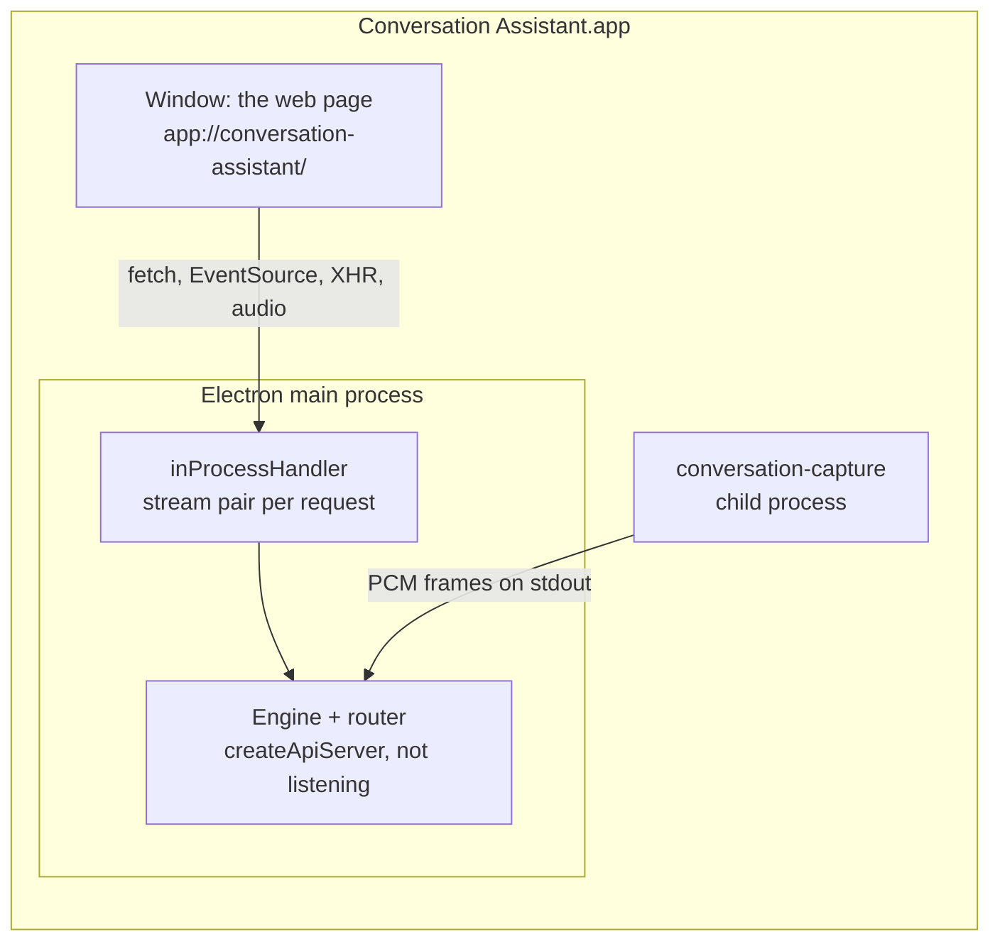

# The Mac app

Conversation Assistant ships as a Mac app for people who never open a terminal: download the DMG, drag the app to Applications, open it. It is the same engine and the same web page as `npm run serve`, packaged with Electron (added 27 September 2026). Developers keep running `npm run serve` and the CLI tools as before.

It is distributed by direct download, signed with a Developer ID and notarized by Apple, not through the Mac App Store: the App Store requires the App Sandbox, which the system-audio tap, the capture helper, and `afconvert` would all have to live within.

## How it runs: one process, no port

- **The engine runs inside Electron's main process** (`desktop/main.ts` calls `bootEngine()` from `src/server/main.ts`, the same start-up `npm run serve` uses). Electron 44 bundles Node 24, the version the engine needs.
- **The page loads from `app://conversation-assistant/`**, a private scheme registered as standard, secure, fetch-capable, and streaming. `protocol.handle("app", …)` passes each request to `inProcessHandler` (`src/server/inProcess.ts`), which feeds it to the unchanged router over an in-memory stream pair (`stream.duplexPair()` with `http.request({ createConnection })`) and streams the response back. JSON, server-sent events, Range requests for playback, uploads, and downloads all work unchanged, and the page's relative URLs (`fetch("/api/state")`) need no change.
- **No TCP port.** Nothing listens, so nothing can collide with another program (4317, the port `npm run serve` uses, is also OpenTelemetry's default), and no other program or website can reach the engine. The address never changes, so the page's saved preferences and `/recordings/<id>` links survive restarts.
- **The capture helper** is a child process, as with `npm run serve`; it only writes audio to a pipe.

### The in-process connection — `src/server/inProcess.ts`

- **Closes are linked across the pair.** `duplexPair()` does not pass one side's close to the other. Without the link, a page closing `/api/events` (a reload, or leaving) left the router subscribed and writing to a dead stream for good (tested in `tests/inProcess.test.ts`).
- **One pair per request:** `Connection: close`, so each pair closes when its response ends.
- **The setup-route guard.** The router's setup routes answer only the page itself: a `Host` of this machine, and an `Origin` that matches it (see [Setup](setup.md#routes-and-the-gate)). The window's `Origin` is `app://conversation-assistant`, so the handler presents each request as `Host: 127.0.0.1` with no `Origin`. That is true by construction: only the app's own window reaches this handler.
- The page comes with the router's Content Security Policy (`PAGE_CSP` in `src/server/main.ts`, the same as with `npm run serve`): scripts, fonts, media, and connections from the app only; inline styles allowed, because the page sets styles from code.

## Where the app keeps its files — `src/paths.ts`

`appPaths()` says where the engine finds everything. Its defaults are the project folder's, which `npm run serve`, the CLI tools, and the tests use unchanged. The packaged app calls `setAppPaths()` before the engine starts. Every consumer reads the paths at each use, never at import, so the call always applies.

| Path | `npm run serve` / CLI / tests | The Mac app |
| --- | --- | --- |
| `root` (`package.json`, `LICENSE`) | the project folder | inside `app.asar` (`app.getAppPath()`) |
| `web`, `config`, `models` | `web/`, `config/`, `models/` | `Contents/Resources/…`, read-only |
| `helper` | `native/capture/.build/release/conversation-capture` | `Contents/Resources/bin/conversation-capture` |
| `sessions` | `sessions/` | `~/Library/Application Support/Conversation Assistant/sessions` |
| `src` (the restart banner's watch) | `src/` | none: `/api/engine` never reports stale |

- `~/Library/Application Support/Conversation Assistant/` (`appSupportDir()`) also holds `credentials.json`, the keys saved from the setup page ([Setup](setup.md)), and `Window/`, the window's own storage (the preferences the page remembers). The app's working directory is set there too, so anything still relative lands there, never in `/`.
- The config is read-only in the app. Label edits never needed to write it: they are saved in each recording ([Recordings](recordings.md)).
- **Recordings made with `npm run serve` stay in the project's `sessions/`.** To see them in the app, move the folders into the app's `sessions/` folder (**File → Show Recordings in Finder**), or export and import them.
- The packaged app never enforces the $3 development cap ([Architecture](architecture.md#budgets--srcbudgetts)): it guards a developer's replays, and the app's users have the per-session cap.
- `npm run app` (Electron from the project folder) keeps the project's paths, like `npm run serve`, with `root` set to the project and `src/` watched: the engine is bundled at build time, so an edit under `src/` needs `npm run app` again, and the page says so.

## The window — `desktop/main.ts`

- **One instance.** Opening the app again focuses the open window.
- **Closing the window keeps the app running**, and any show on air with it, as Mac apps do. The Dock icon reopens it.
- **Links to other sites** (the key setup steps, fact-check sources) open in the default browser (`setWindowOpenHandler`). Any other navigation away from `app://conversation-assistant/` is refused.
- **Exports** are saved to Downloads, like a browser: `<name>.conversation-recording`, then `<name> (2).conversation-recording` if taken. The Dock's Downloads stack bounces when one finishes.
- **Imports** (the Import button, or a file dropped on the window) work as in a browser. The upload is in-process and instant, and the scheme reports no upload progress, so the progress bar moves back and forth while the recording is unpacked (`web/src/transfer.ts`).
- **The menu:** the standard app, Edit, View, and Window menus; **File → Show Recordings in Finder**; **Help → Conversation Assistant on GitHub**, **License**, **Third-Party Notices**, and **Chromium Licenses** (the files in `Contents/Resources/licenses/`). **About** shows the version, the license, and where the third-party notices are.
- **No browser permissions** but the clipboard: Electron grants a page any permission it asks for unless told otherwise, so the window refuses them all except `clipboard-sanitized-write` (the chat's Copy buttons). Capture never goes through the page.
- **No DevTools in the packaged app** (`webPreferences.devTools`): code pasted into its console would run with the app's microphone grant. `npm run app` keeps them.
- **Every dialog is a sheet on the window** (`ask()`). A dialog without a window runs macOS's modal loop (`NSAlert runModal`), which stops the main process until it is answered, and with it the engine: a show on air would stop being captured (see [Gotchas](gotchas.md#mac-app-electron)).

## macOS permissions

macOS asks for **Microphone** and **System Audio Recording** the first time the capture helper starts, and gives both to the app: it attributes the helper's requests to the app that launched it (verified in macOS's permission log, `tccd`). System Settings → Privacy & Security lists **Conversation Assistant**, not Terminal.

- **First launch.** When the microphone permission is undetermined, the app shows a sheet, "Conversation Assistant needs two permissions", then starts the helper for a moment (`--probe 1`), so macOS asks both questions now rather than at the start of a show.
- **A refused microphone.** At each launch, the app offers to open System Settings at Privacy & Security → Microphone. A refused System Audio Recording cannot be detected before a session: it records silence, which the page's stream meter shows in red ([Architecture](architecture.md#web-front-end--web)).
- **Grants follow the signature.** macOS ties them to the app's code signature, so every version must be signed with the same Developer ID, or an update loses them. Ad-hoc test builds (below) are a different app to macOS.
- **In development** (`npm run app`, or `npm run serve`), macOS still asks on behalf of the terminal that started it, so the first-launch sheet is skipped.

## A show in progress

- **The Mac stays awake:** a `prevent-app-suspension` power-save blocker runs from `session.started` to `session.ended`.
- **Quitting** (⌘Q, or restarting for an update) while a session is on air asks first. **Stop and Quit** stops the session and waits up to 30 s for it to end. The audio is complete within seconds, because the session writes its WAVs' final headers as soon as its input ends (`SessionStore.closeAudio`, at the start of the session's ending), before transcriptions and fact-checks drain. Lines still in flight may be lost; pressing Stop and waiting keeps them.
- **Updates are never looked for or downloaded while a session is on air** (below).

## Updates

`electron-updater` checks the project's GitHub Releases (`publish` in `electron-builder.yml`: `nicolasdao/conversation-assistant`) at launch and every 4 hours, only in the packaged app and only while nothing is on air, so a download never competes with a live call. It downloads the new version's zip in the background (only the changed blocks, using the `.blockmap` files) and installs it when the app quits. When a download is ready and nothing is on air, a sheet offers **Restart Now** or **Later**.

- It needs a signed app: macOS refuses to update an ad-hoc build.
- It reads `latest-mac.yml` from the newest published (not draft, not pre-release) GitHub Release.
- Installed copies look for updates in the repository they were built with. The project moved to `nicolasdao/conversation-assistant` on 27 September 2026, before its first published app, so no installed copy points at the old `podcast-ai-assistant` repository. If it moves again, change `publish` in `electron-builder.yml` and the `REPO` link in `desktop/main.ts`, and keep publishing to the old repository until installed copies have updated.

## Building

| Command | Does |
| --- | --- |
| `npm run app` | Builds the page and the bundle, then opens the app from the project folder (development) |
| `npm run build:desktop` | Bundles `desktop/main.ts` and the engine with esbuild into `dist/desktop/main.mjs` (ESM; `electron`, `electron-updater`, and `sherpa-onnx-node` stay external) |
| `npm run dist:mac` | `scripts/build-mac.sh`: the models if missing, the capture helper, the page, the bundle, then electron-builder into `out/` |

`npm run dist:mac` writes `out/Conversation-Assistant-<version>-arm64.dmg` (what people download), `out/Conversation-Assistant-<version>-arm64-mac.zip` (what updates download), their `.blockmap` files, `out/latest-mac.yml`, and the app itself in `out/mac-arm64/`. It takes about 3.5 minutes. Measured at 0.5.0: the app is 307 MB, the DMG 144 MB; Electron's framework is most of it, then sherpa-onnx (33 MB) and the models (26 MB).

What `electron-builder.yml` puts in the app:
- `app.asar`: the bundle, `package.json` (the version), and `LICENSE`, plus the production `node_modules` (`electron-updater`, `sherpa-onnx-node`).
- `app.asar.unpacked`: sherpa-onnx's addon and dylibs, which cannot load from inside the archive.
- `Contents/Resources/`: `web/` (without source maps), `config/`, `models/*.onnx`, and `bin/conversation-capture`.
- `Info.plist`: the bundle id `com.cloudlesslabs.conversation-assistant`, macOS 14.2 or later (the Core Audio process tap), and the Microphone and System Audio usage descriptions macOS shows in its prompts.
- English only (`electronLanguages`): the page is in English, and Electron's other languages cost 47 MB.
- Apple Silicon (`arm64`) only, like the capture helper and sherpa-onnx's addon.

The icon is `desktop/icon.svg`, the page's favicon as an app icon. After changing it, `npx electron scripts/make-icon.mjs` renders `desktop/icon.icns`.

### Signing and notarization

`scripts/build-mac.sh` picks the signature from the keychain:

| Keychain | Result | Runs on |
| --- | --- | --- |
| A "Developer ID Application" certificate, and notary credentials | Signed, notarized, and stapled | Any Mac, with one "downloaded from the internet" question |
| The certificate, no notary credentials | Signed, **not notarized** (the script says so) | Blocked by Gatekeeper on other Macs |
| No certificate | Signed **ad hoc**, with `desktop/entitlements.adhoc.plist` | This Mac only: for testing |

- **The certificate** is "Developer ID Application: Nicolas Dao (UX774V7BK2)", created in Xcode (Settings → Accounts → Manage Certificates → + → Developer ID Application), which puts it and its private key in the login keychain. The app's identity is not tied to this certificate: its designated requirement is the bundle id, a Developer ID certificate from Apple, and the Team ID `UX774V7BK2` (`codesign -d -r-`). So if the private key is lost, a new Developer ID certificate from the same account signs updates that keep every user's permissions and install over the old version. A `.p12` export (Keychain Access, which macOS 26 keeps in `/System/Library/CoreServices/Applications/`: login → My Certificates → right-click → Export) only saves recreating it. What cannot be replaced is the Apple account, and its yearly membership: when it lapses, installed copies keep working (their signatures are timestamped and notarized), but no new version can be signed or notarized.
- **Notary credentials** are an App Store Connect API key (Users and Access → Integrations → Team Keys, Developer role), saved once in the keychain as the profile `conversation-assistant`: `xcrun notarytool store-credentials conversation-assistant --key AuthKey_<id>.p8 --key-id <id> --issuer <issuer id>`, which checks them with Apple. `scripts/build-mac.sh` and `publish-app.sh` use that profile when nothing else is set, so nothing goes in the shell profile, and the `.p8` file is no longer needed. They also accept `APPLE_KEYCHAIN_PROFILE`, `APPLE_API_KEY` (path to the `.p8`) with `APPLE_API_KEY_ID` and `APPLE_API_ISSUER`, or `APPLE_ID`, `APPLE_APP_SPECIFIC_PASSWORD`, and `APPLE_TEAM_ID`.
- **Entitlements** (`desktop/entitlements.mac.plist`, for the app and every binary in it, the helper included): `cs.allow-jit` and `cs.allow-unsigned-executable-memory` for V8, and `device.audio-input` for the microphone under the hardened runtime.
- **`desktop/entitlements.adhoc.plist`** adds `cs.disable-library-validation`, without which an ad-hoc build does not launch (see [Gotchas](gotchas.md#mac-app-electron)). A release never uses it.
- **Tested on 27 September 2026** with the first Developer ID build (0.5.0): signed, notarized (Apple took 31 minutes for the account's first submission) and stapled; `syspolicy_check distribution` passes; Gatekeeper accepts the app as "Notarized Developer ID", also when copied out of a quarantined DMG; the fuses read as set; the app opens normally, and refuses `ELECTRON_RUN_AS_NODE` and `--remote-debugging-port`. **Not yet tested:** updates, and permissions surviving an update (both need two published versions).
- **The DMG itself is not signed**, only the app inside it (`spctl --assess --type open` on the DMG says "no usable signature"). Gatekeeper judges the app when it is opened, which is accepted. This is electron-builder's default and advice (`dmg.sign` is off): a DMG signed but not notarized is judged more harshly than an unsigned one.

### Hardening

A signed app holds the user's Microphone and System Audio Recording grants, so it must not run anyone else's code with them.

- **Fuses** (`electronFuses` in `electron-builder.yml`, flipped in the Electron binary at build time): no `ELECTRON_RUN_AS_NODE` (which would turn the app into a Node interpreter with its grants), no `NODE_OPTIONS`, no `--inspect`; the app loads only from `app.asar`, and Electron checks the archive against the hash signed into the app, so a modified archive does not start.
- **No remote debugging.** Chromium's `--remote-debugging-port` and `--remote-debugging-pipe` have no fuse, and would let any local program drive the window, and through it the engine. The packaged app exits when started with either (`desktop/main.ts`). Test a packaged build by opening it normally; drive the page with `npm run app`, which allows DevTools.

### Licenses

The app ships every license it must, in `Contents/Resources/licenses/`, opened from the Help menu:

- `LICENSE.txt`: the project's BSD 3-Clause license (also in `app.asar`, and in the settings menu's license window).
- `THIRD_PARTY_NOTICES.txt`: `THIRD_PARTY_NOTICES.md`, generated by `scripts/third-party-notices.mjs` (`npm run notices`) from the installed production dependencies, plus the components npm does not list: Electron and its frameworks, sherpa-onnx's native libraries, ONNX Runtime, eSpeak NG, the two models, and the fonts. `npm run dist:mac` regenerates it; the release gates (`checks.sh`, `publish-app.sh`) fail when the committed copy is out of date.
- The full texts it refers to (`licenses/`: Apache-2.0, GPL-3.0, MIT, ONNX Runtime's license and third-party notices, Silero VAD's, and the three Electron frameworks'), `LICENSE.electron.txt`, and `LICENSES.chromium.html` (Chromium, Node.js, FFmpeg, and the rest of Electron).

**The GPL-3.0 component.** sherpa-onnx's prebuilt `libsherpa-onnx-c-api.dylib` compiles in eSpeak NG (text-to-speech, unused here; see [Gotchas](gotchas.md#sherpa-onnx)). So every release attaches the exact sources it was built from: sherpa-onnx at the version's tag, and eSpeak NG at commit `ed530aa1…` (its SHA-256 is checked by `publish-app.sh`). The project's own code stays BSD 3-Clause, which is compatible with the GPL. Building sherpa-onnx without text-to-speech would remove it, but the Node addon references the text-to-speech functions, so both native files would have to be rebuilt.

**The models.** Silero VAD is MIT. The WeSpeaker speaker model is CC BY 4.0, which requires the attribution in the notices.

### Publishing

A release publishes the app as the GitHub Release `v<version>`: the DMG, the zip, their blockmaps, `latest-mac.yml`, an SBOM (`…-sbom.cdx.json`, CycloneDX, from `npm sbom`), and the two source archives of the GPL component; the notes end with the SHA-256 of the DMG and the zip. Before building, `publish-app.sh` installs exactly the locked dependencies (`npm ci`), verifies their registry signatures (`npm audit signatures`), refuses a high-severity advisory in what ships (`npm audit --omit=dev`), and checks the notices. On GitHub, releases are immutable once published, release tags cannot be moved or deleted, and `master` cannot be force-pushed or deleted. The release skill's last step does it after the push, with its own confirmation, through `.claude/skills/release-conversation-assistant/scripts/publish-app.sh`, which builds from the tag, checks the signature, notarization, and Gatekeeper, and refuses an ad-hoc or unnotarized build (see the README's [Releasing](../README.md#releasing)). A download page for the DMG is not part of this project yet.

Related: [Architecture](architecture.md), [Setup](setup.md), [Recordings](recordings.md), [Gotchas](gotchas.md#mac-app-electron), [Mission](mission.md).
