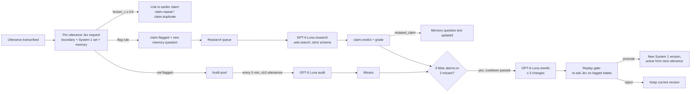

# System 1 and System 2

The fact-checker borrows Kahneman's two systems of thinking:

| | System 1 | System 2 |
| --- | --- | --- |
| Is | [Jev](jev.md), plus a set of questions and thresholds | GPT-6 Luna (`openai/gpt-6-luna`) through OpenRouter, with web search |
| Runs | On every utterance, inside the per-utterance request | Only when System 1 flags a claim, every 5 minutes for an audit, and when evidence triggers a rewrite |
| Speed and cost | ~0.4–0.8 s, ~$0.00004 per utterance | ~6–16 s and ~$0.008 per researched claim |
| Output | Typed judgments: is this a checkable claim, what kind, how much it matters, is it a repeat | A verdict with sources; audit findings; proposed rewrites of System 1's questions |

The point: a slow, expensive model is called only when the fast one finds something worth checking, and the slow model **improves** the fast one. Jev's weights never change. **System 1 is Jev plus its questions**, and System 2 improves it by changing the questions, through three channels:

1. **Memory** — every flagged claim becomes a `known_<claimId>` question, so a repeat is recognised instantly on the next utterance instead of being researched again.
2. **Criteria** — false alarms (a flag that was not a checkable claim) and misses (a claim that was not flagged) lead System 2 to rewrite System 1's instructions, criteria, and thresholds.
3. **Attention** — System 2 can add up to 3 `attention_<n>` questions that raise the priority of kinds of claims that turned out to matter.

Fact-checking can be turned off when a session starts; then System 1's questions leave the per-utterance request and System 2 is never called (see [Architecture](architecture.md#features-transcript-only-sessions)).

The outcome signal that makes improvement possible is the **grade**: every research verdict grades the flag that triggered it. (The timeline has no such signal, so no LLM changes the timeline's questions — the host is System 2 there. See [Jev](jev.md).)



## System 1

### The question set (`s1@1`)

`config/factcheck.s1.default.json`. Every question opens with "Judge only new_utterance." because each Jev question is answered independently against the whole state, which also contains `current_segment`.

| Id | Type | Question |
| --- | --- | --- |
| `claim` | noul | It states a specific factual claim that could be checked against public sources, such as a number, price, date, ranking, quote, attribution, release, or product capability. **True:** at least one concrete, checkable statement of fact. **False:** an opinion, joke, question, feeling, exaggeration, vague statement, or no factual content. |
| `claim_type` | choice | What kind of factual claim does it make? `number_or_price`, `date_or_release`, `quote_or_attribution`, `capability_or_benchmark`, `event`, `prediction`, `none` |
| `public` | noul | Its factual claim is about the public world, such as companies, products, AI models, public figures, prices, statistics, science, laws, or news, so a web search could confirm or refute it. **True:** a claim about something outside the speakers' private lives that public sources could confirm or refute. **False:** about the speakers themselves or people they know (their family, friends, feelings, plans, or personal experiences), or no factual claim. |
| `hedged` | noul | The speaker signals uncertainty about a fact, such as "I think", "if I remember correctly", "something like", or "don't quote me". |
| `worth` | score | How much would listeners care whether its factual claim is accurate? 0 No factual claim, or trivial · 1 A minor detail · 2 Relevant to the discussion · 3 Central to the speaker's argument · 4 Surprising or high-stakes if wrong |

These ride in the **same** Jev request as the segmenter's `boundary` question, so fact-checking adds no requests and a card can appear without waiting for a segment to close.

### The flag rule

Using the active version's thresholds (`s1@1`: `claimThreshold` 0.7, `publicThreshold` 0.6, `worthMin` 1.5, `attentionThreshold` 0.7), an utterance is **flagged** when all four hold:

```text
claim ≥ claimThreshold   AND   claim_type ≠ none   AND   public ≥ publicThreshold   AND   worth ≥ worthMin
```

(A System 1 version without a `public` question, from before it existed, does not gate on it.)

Its research priority is:

```text
priority = worth
         + 0.5  if hedged ≥ factcheck.hedgedThreshold (0.6)
         + 1    if any attention_* ≥ attentionThreshold
```

**Why `public` exists.** In a one-hour personal call between two people, System 1 flagged 45 lines, almost all first-person accounts of private events (an argument, an accident): `claim` asks for a fact "checked against public sources", but nothing made the *subject* public, so a concrete personal event scored as an `event` claim. 20 came back `unverifiable` yet were graded good flags, the audit counted personal statements as misses, and three promoted rewrites widened System 1 further ("personal, first-person factual clauses count"). Re-asking Jev only the `public` question on the flagged lines: all 45 personal flags scored ≤ 0.43 (most 0.02) and would not be flagged, while all 13 public claims flagged in earlier AI-podcast sessions ("Jev is 445 times cheaper than GPT", the planted Suez and JFK conspiracies, a Reuters/Ipsos poll) scored 0.85–0.97. The measurement cost $0.0016.

`worthMin` is 1.5, not the original 2: "Jev can never hallucinate" scored `worth` 1.94–2.01 across runs, so at 2 it was flagged only some of the time. Fillers and failed transcriptions never reach System 1; an utterance whose Jev request fails is not fact-checked.

### Memory questions

When a claim is flagged it gets an id `c_<n>`, and a memory question is added to every later per-utterance request:

```text
known_c_1 (noul): Judge only new_utterance. It restates or relies on this already-checked claim: "<claim>"
  true:  new_utterance states the same factual claim again, in the same or different words.
  false: new_utterance makes a different claim, or only reacts to, questions, or disputes the claim.
```

- `<claim>` is the utterance text until the verdict arrives, then the verdict's `restated_claim`.
- At most `maxKnownQuestions` (40) are kept; the oldest is evicted first.
- **Memory is checked before the flag rule.** If any `known_*` answer is ≥ `knownMatchThreshold` (0.6), the utterance links to the best-matching claim and is **not** flagged: `claim.repeat` (with the stored verdict — an instant card) if that claim has a verdict, else `claim.duplicate`. No second research call is made.
- Memory questions are **not** part of any System 1 version: adding, updating, or evicting one emits `s1.memory` and never goes through the gate, and promotions and rollbacks keep the current memory set.

The opener and the criteria are this project's addition to the spec's wording, and the threshold is 0.6 rather than 0.8, because of measurements: with the bare sentence, a verbatim repeat scored 0.55 and a mere reaction to the claim 0.50; with this wording, repeats score 0.73–0.87 and non-repeats ≤ 0.06.

### Versions

A **System 1 version** is the question set plus its three thresholds, with `id` (`s1@<n>`), `parent`, `kind` (`default` or `criteria`), `createdAt`, `rationale`, `gate` (metrics, or null), and `status` (`default`, `promoted`, or `rejected`). Versions are immutable, and every one — including rejected and invalid candidates — is appended to `s1_versions.jsonl`. Every session starts from `s1@1`; versions do not carry over between sessions. The starting version (`s1@1`) is recorded in `session.json`; every change of active version is in an `s1.version` event.

## System 2

All System 2 calls go through `S2Client` in `src/factcheck/s2.ts`: OpenRouter chat completions, `model: openai/gpt-6-luna`, `provider: { order: ["openai"], allow_fallbacks: false, require_parameters: true, data_collection: "deny" }`, a strict `json_schema` response format, no `temperature` or `top_p`, and no function calling. Each call uses a 90 s timeout and at most 2 attempts with the same retry classification as the [Jev client](jev.md). Every call is logged to `s2_calls.jsonl` with purpose, latency, attempts, returned model and provider, token usage (including reasoning and cached tokens), and `cost_usd`.

System prompts are byte-identical across calls (the research prompt changes only with the date), so their tokens can be served from the provider's prompt cache ($0.01 instead of $0.10 per million input tokens).

### The research queue — `src/factcheck/queue.ts`

- **Highest priority first**, ties by earliest flag, served by `researchConcurrency` (2) workers.
- **Caps:** `maxResearchPerHour` (30, a sliding window) — further items wait for a slot; `maxResearchPerSession` (40) — beyond it, queued items are dropped with `claim.dropped` reason `session_cap`.
- **Staleness:** an item queued longer than `staleAfterMs` (10 minutes) is dropped with reason `stale`.
- At session end, research is drained for at most 180 s; anything still queued is dropped with reason `stopped`.

### Research

The request adds `plugins: [{ id: "web", engine: "exa", max_results: 5 }]` and `reasoning: { effort: "medium" }`. The system message:

> You fact-check one spoken claim from a live English-language AI podcast. Today is <date>. Your own knowledge ends in May 2026, so rely on the web results for anything after that, and never call something false only because you have not heard of it. Judge the claim as a listener would understand it. Verdicts:
> - supported: accurate.
> - contradicted: false.
> - misleading: technically true but missing context that changes its meaning, or a vendor's own claim presented as fact.
> - unverifiable: no reliable source found.
> - not_a_claim: an opinion, joke, exaggeration, or too vague to check.
>
> restated_claim is one precise sentence. correction is at most 25 words saying what is true. Cite only sources you used.

The user message holds only the speaker's display name, the utterance, and the last 1,500 characters of the segment so far (each line as `Name: text`).

The verdict schema (strict; every field required, no extra properties):

| Field | Type |
| --- | --- |
| `restated_claim` | string |
| `verdict` | `supported` · `contradicted` · `misleading` · `unverifiable` · `not_a_claim` |
| `correction` | string, empty when supported |
| `confidence` | `low` · `medium` · `high` |
| `false_alarm_reason` | `none` · `hyperbole` · `joke` · `opinion` · `too_vague` · `trivial` · `not_factual` |
| `sources` | array of `{ url, title }` |

Length and count limits are kept out of the strict schema and enforced in code (`finalizeVerdict`):

1. Inline markdown citations the web plugin inserts are stripped from `restated_claim`, `correction`, and source titles.
2. `restated_claim` is truncated to 200 characters and `correction` to 25 words.
3. `message.annotations[].url_citation` entries are merged into `sources`, deduplicated by URL, then the first 3 are kept.
4. A `supported`, `contradicted`, or `misleading` verdict with no source becomes `unverifiable`, marked `downgraded: true`.

If strict output were rejected together with the web plugin, the client retries once with `response_format: { type: "json_object" }` plus a zod parse, and keeps using it; so far strict output has worked with both the `exa` and `native` engines.

### Grading and the host's override

```text
grade = false_alarm   if verdict = not_a_claim  OR  false_alarm_reason ≠ none
        good_flag     otherwise
```

`false_alarm_reason` is one of `none`, `hyperbole`, `joke`, `opinion`, `too_vague`, `trivial`, `not_factual`, or `private`: the research prompt says that a claim about the speakers' own private lives cannot be checked against public sources and must come back `not_a_claim` with reason `private`, so such a flag grades as a false alarm and teaches System 1 instead of passing as a good flag.

A grade counts toward the System 1 version that was active **when the claim was flagged**. The host can dispute any verdict (`POST /api/claims/:id/override`, the "Host disputes" button): the claim is marked disputed (`claim.disputed`), and its grade leaves the evidence — it no longer counts toward rewrites or the gate.

### Audits: finding misses

A flag that should not have happened shows up as a false alarm; a claim that was never flagged needs an audit to be found.

- **When:** every `auditIntervalMs` (5 minutes) of **session time** (the audio clock, so a fast replay audits like a live show), if at least `auditMinUtterances` (10) unflagged, non-filler utterances have accumulated since the last audit. Utterances linked as repeats are not in the pool.
- **What:** a random sample of up to `auditSample` (10) of them, as `{ utterance_id, speaker, text }`, sent without web search at `effort: low`, with the system message:

  > You audit a live AI podcast's fact-checker. For each utterance, say whether it contains a specific factual claim that could be checked against public sources, and how much listeners would care whether it is accurate. A checkable claim is about the public world: companies, products, AI models, public figures, prices, statistics, science, laws, or news. Opinions, jokes, exaggerations, and vague statements are not checkable claims, and neither is anything about the speakers' own private lives (their family, friends, feelings, plans, or personal experiences), however concrete.

  The rewrite prompt carries the same rule ("the speakers' private lives never count, so never widen the questions to include them"), and a rewrite may tune `publicThreshold` only within 0.5–0.9, never remove it.

- **Schema:** `{ items: [{ utterance_id, has_checkable_claim: boolean, worth: "low" | "medium" | "high" }] }`.
- **A miss** is an item with `has_checkable_claim` true and `worth` not `low`. Results go to `audits.jsonl` and an `audit` event.

### Rewrites

**Trigger** — all of:

- since the active version became active, its evidence reaches `rewriteOnFalseAlarms` (3) false alarms **or** `rewriteOnMisses` (2) misses — counting only claims flagged under that version and graded after it became active, and misses of utterances evaluated under that version and found after it became active, excluding disputed claims; memory changes do not reset the count;
- no rewrite ran within the last `rewriteCooldownMs` (3 minutes of session time);
- no rewrite is already running.

**Call** — no web search, `effort: medium`, with the system message:

> You improve the questions a fast classifier uses to flag checkable factual claims in a live AI podcast. You get the active questions and thresholds, false alarms (flagged but not checkable) with reasons, correctly flagged examples, and missed claims. Propose at most 3 changes that remove false alarms or catch misses without losing correct flags. Follow these question rules: one narrow judgment per question, concrete true and false descriptions for yes/no questions, never ask for counting or arithmetic.

The user message is JSON: the active questions and thresholds, the false alarms with their verdict and reason, and up to 10 good flags and 10 misses as utterance texts.

The reply is `{ changes: [...], rationale }`, where each change is `{ op, target, text, true_text, false_text, options, levels, number }` with the unused fields null. Code (`applyRewrite` in `src/factcheck/s1.ts`) rejects the **whole** rewrite if it proposes no changes or more than 3, or if any change breaks these rules:

| Op | Target | Must fill (all else null) | Limits |
| --- | --- | --- | --- |
| `set_instructions` | `claim`, `claim_type`, `hedged`, `worth` | `text` | ≤ 400 characters, not empty |
| `set_criteria` | `claim` or `hedged` | `true_text`, `false_text` | Not empty |
| `set_criteria` | `claim_type` | `options` | Exactly its 7 existing keys (descriptions only change; `none` stays) |
| `set_criteria` | `worth` | `levels` | Exactly 5, lowest first |
| `add_attention` | `"new"` | `text`; optionally both `true_text` and `false_text` | ≤ 400 characters, not empty; code assigns `attention_<n>`; at most 3 attention questions |
| `remove_attention` | an existing `attention_<n>` | — | |
| `set_threshold` | `claimThreshold` or `attentionThreshold` | `number` | Within [0.5, 0.9] |
| `set_threshold` | `worthMin` | `number` | Within [1, 3] |

System 2 can never touch `boundary`, the timeline labels, `hedgedThreshold`, the memory threshold, or any budget. A valid rewrite becomes a candidate `s1@<n>`, where `n` is one more than the number of versions recorded so far, rejected ones included (`kind: criteria`, `parent` = the active version); an invalid one is still recorded, as a rejected version with its `errors` (outcome `invalid`).

### The replay gate — `src/factcheck/gate.ts`

A candidate is promoted only if it fixes errors while keeping at least 90% of the good flags, measured on what actually happened in this session.

**Items:** the logged per-utterance Jev states (the `state` of `jev_calls` rows with `purpose: "utterance"`), newest first, up to `replayMaxItems` (300), in three sets:

- **G** — flagged utterances graded `good_flag`;
- **F** — flagged utterances graded `false_alarm`;
- **M** — utterances an audit found missed.

**Steps:** re-ask each state with the candidate's `claim`, `claim_type`, `hedged`, `worth`, and `attention_*` questions (no `boundary`, no memory questions; `purpose: gate`, background settings, counted in the budget); apply the candidate's flag rule; count how many items of each set it flags — G′, F′, M′. An item whose re-ask fails counts as not flagged.

**Decision:**

```text
promote  ⇔  G′ ≥ floor(0.9 × |G|)   AND   ( F′ < |F|   OR   M′ > 0 )
```

It must keep at least 90% of the good flags and either drop at least one false alarm or catch at least one miss. For example, with |G| = 10 and |F| = 3: G′ = 9, F′ = 2 promotes; G′ = 8 rejects (lost good flags); G′ = 10, F′ = 3 rejects (fixed nothing).

Both outcomes are appended to `s1_versions.jsonl` with their metrics and rationale, and emitted as `s1.version` (`outcome`: `promoted`, `rejected`, `invalid`, or `gate_failed`; `active` is always the version now in force). A promoted version applies **from the next utterance**. Jev's answers are not bit-reproducible, which is why the gate compares a freshly re-asked candidate against the outcomes that were actually graded, rather than re-asking the incumbent.

**Rollback:** `POST /api/s1/rollback { version }` restores `s1@1` or any promoted version (never a rejected one), keeps the memory set, restarts the evidence count, and emits `s1.version` with outcome `rollback`.

## Events and files

| Event | When |
| --- | --- |
| `claim.flagged` | System 1 flags an utterance (claim id, text, priority, claim type, worth, hedged, version) |
| `claim.duplicate` / `claim.repeat` | A memory question matched a claim without a verdict (queued, researching, or dropped) / with a verdict |
| `claim.researching`, `claim.verdict`, `claim.dropped` | Research status; the verdict carries the grade and latency |
| `claim.disputed` | The host overrode a verdict |
| `s1.memory` | A memory question was added, updated, or evicted |
| `audit` | An audit finished (sample size, misses) |
| `s1.version` | A rewrite was promoted, rejected, invalid, or failed its gate, or a rollback happened |

Files in the session folder: `claims.jsonl` (one row per status change), `verdicts.jsonl`, `s1_versions.jsonl`, `audits.jsonl`, `s2_calls.jsonl`, and `jev_calls.jsonl` (see [Recordings](recordings.md)). Each `s2_calls.jsonl` row also keeps the prompt as sent (`request: { system, user }`) and the model's reply text (`response`), so the page's **Fast · slow thinking** tab can show System 2 at work; rows from before this was added have neither. Every Jev and System 2 call also streams to the page as transient `call.started` / `call` events.

## Measured so far

| Measurement | Value |
| --- | --- |
| Research (exa), 28 calls | median 10.2 s, median $0.0076 |
| Research (native engine), 3 calls | median 12.7 s, median $0.032 — why the config uses exa |
| Research latency shown on cards (from research start to verdict), 23 verdicts | 5.9 s to 15.7 s, median 10.2 s |
| Audit, 4 calls | median 2.5 s, median $0.00007 |
| Rewrite, 3 calls (canned inputs) | median 9.6 s, median $0.0004 |
| Verdicts across all sessions so far (mostly fixture replays, plus two live tests) | 23: 19 misleading, 2 contradicted, 1 supported, 1 unverifiable — all graded `good_flag` |

In real sessions so far, one audit has run (10 utterances sampled, no misses) and no rewrite has triggered, because there have been no false alarms. The rewrite path, the op rules, and the gate are covered by unit tests with fake Jev and a fake System 2 (`tests/factcheck.test.ts`), and a real rewrite call with canned inputs passes smoke check 6.

Related: [Jev](jev.md), [Architecture](architecture.md), [Transcription](transcription.md).
